# Adobe Acrobat Analyzer REST API Overview

Last update: March 1, 2026.

*Adobe Acrobat Analyzer* provides APIs that allow enterprises to automatically ingest, process, search, and extract structured, auditable insights from large volumes of documents, helping teams automate workflows, reduce risk, and make faster decisions at scale.

These APIs enable organizations to:

- Upload and process documents (PDF, DOC, DOCX).
- Search and filter documents and retrieve processing status.
- Retrieve available attributes (or custom insights) for filtering and searching.
- Search and filter processed documents with pagination support to retrieve detailed document-level intelligence and extracted insights.

Access is provided through a **Technical Account** configured in the Adobe Developer Console using **OAuth server-to-server authentication**. This allows secure, system-to-system integration without requiring individual user login tokens.

## Primary API Endpoints

[API methods online](https://svs.na1.adobesign.com/svc/cascade/swagger-ui/index.html)

- `POST /documents`  
  Upload a document for processing.

- `POST /documents/search`  
  Search and filter for documents and retrieve processing status.

- `GET /documents/{documentId}`  
  Retrieve detailed extracted data for a specific document.

- `GET /attributes`  
  Retrieve available attributes (custom insights) for filtering and searching.

## Getting access to Acrobat Analyzer APIs

To use the APIs, you must create a **Technical Account** in the Adobe Developer Console.

A Technical Account:

- Uses OAuth server-to-server authentication.
- Enables secure API access.
- Eliminates the need for individual user tokens.
- Allows scalable enterprise integration.

### Prerequisites

Before creating a Technical Account:

- You must have [**Developer access**](https://helpx.adobe.com/enterprise/using/manage-developers.html#Adddevelopers), or
- You must be the [**System Administrator**](https://helpx.adobe.com/enterprise/using/admin-roles.html#enterprise) for your organization.

### Create a Technical Account

1. Log in to the *Adobe Developer Portal* (https://developer.adobe.com/) with an organization account that has the required permissions.
2. Go to the *Developer Console* by selecting **Console**.

3. Select **Create a new project**.  
This project represents your Technical Account.

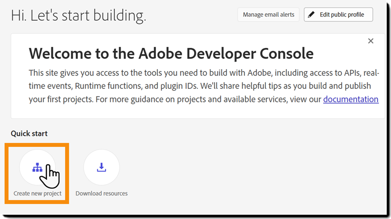

4. Select **Add API**.  

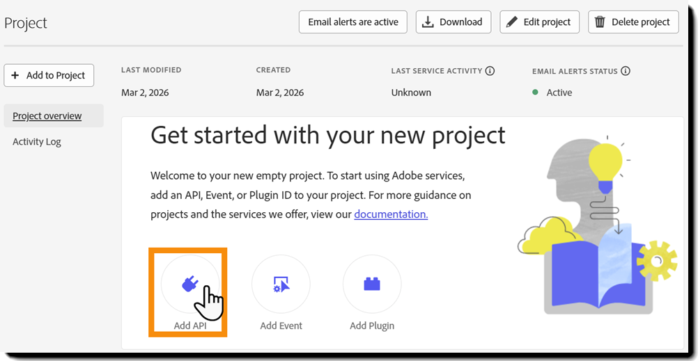

5. Choose the **Adobe Acrobat Sign** product and select **Next**.

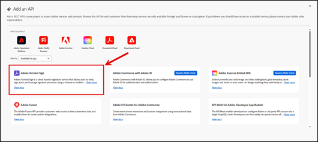

6. Provide a **Credential name**, and then select **Next** to establish OAuth server-to-server authentication. 

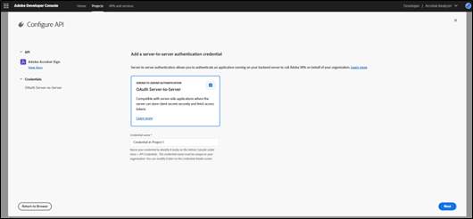

7. Select your Acrobat Sign product profile, and then select **Save configured API**.

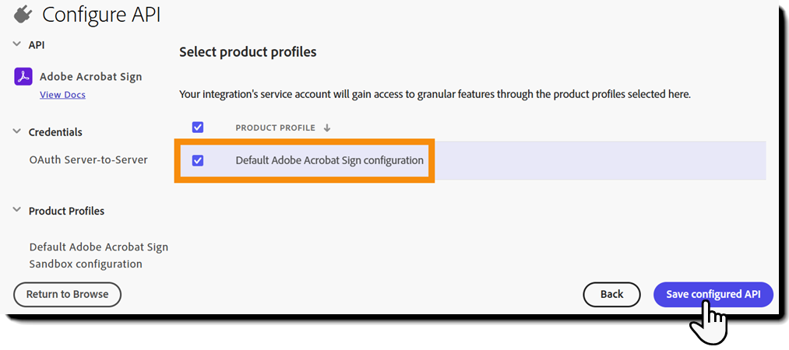

Your Technical Account is now configured.

### Generate an access token

1. In the **Connected Credentials** section of the project page, select **Generate access token**.

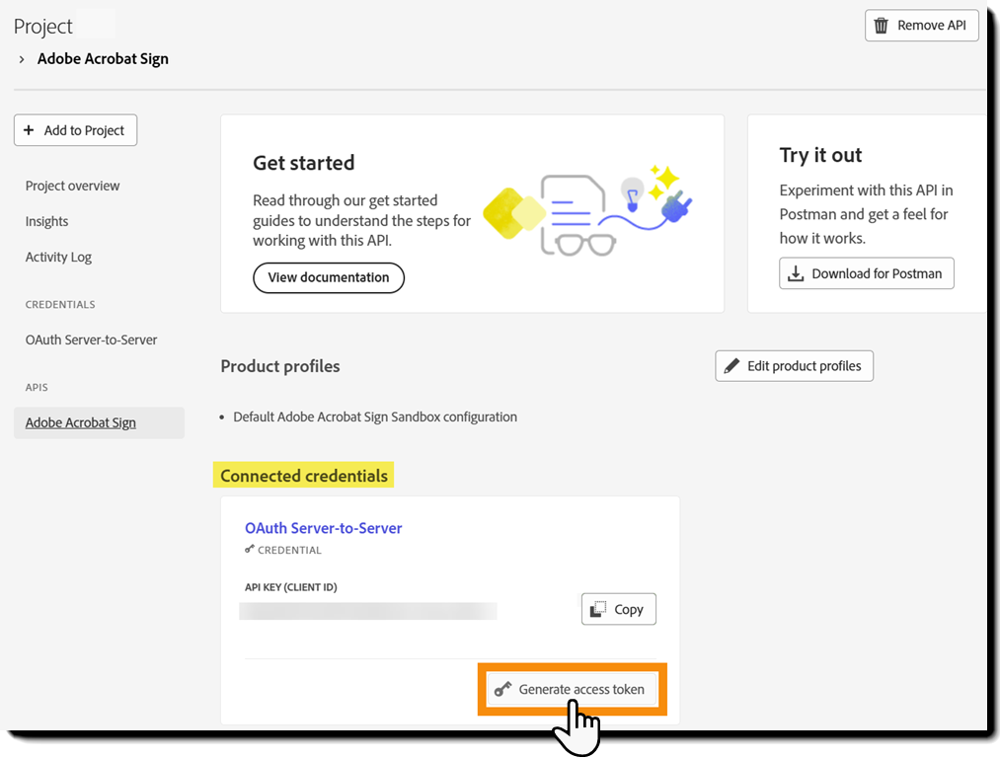

2. Copy the access token. Use this token to authenticate API requests.

Important:

- Access tokens expire every 24 hours.
- Generate a new token after it expires.
- For production integrations, [automate token refresh](https://developer.adobe.com/developer-console/docs/guides/authentication/UserAuthentication/ims#refreshing-access-tokens).

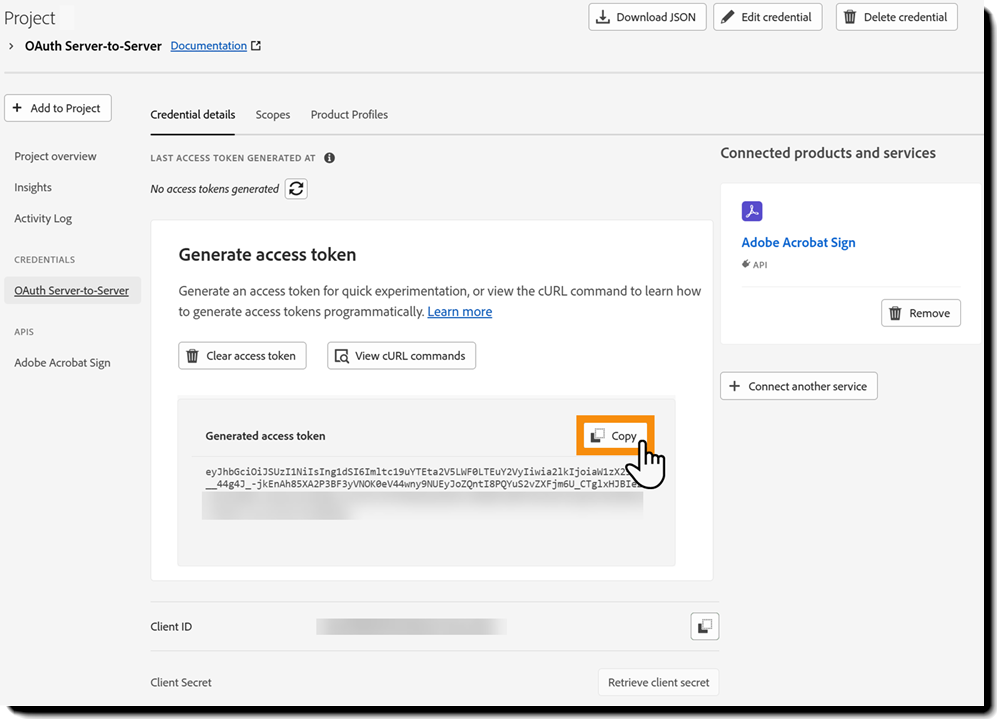

3. Store the access token securely.

## Using *Acrobat Analyzer* APIs

Once you generate the access token, you can begin making API calls:

1. Access the [API methods online:](https://svs.na1.adobesign.com/svc/cascade/swagger-ui/index.html) 

2. Select **Authorize**.

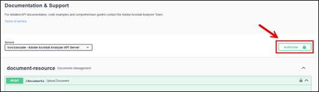

3. Paste your access token into the *bearerAuth Value* text box, and select **Authorize**.

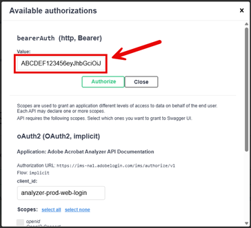

4. Begin invoking API endpoints.

Your system is now authenticated as the Technical Account.

In production environments, include the token in the `Authorization` header of each API request.

## Enable X-On-Behalf-of access (optional)

### What is x-on-behalf-user access?

Technical Accounts can act on behalf of specific end users within the same organization. This is known as `x-on-behalf-user` access.

When enabled, the Technical Account can:

- Access a specific user's documents.
- Retrieve extracted values from that user's documents.
- Perform searches on that user's data.
- Upload documents into that user's account.
- Extract attributes configured by that user.

This supports enterprise workflows where a central system programmatically manages or extracts data from user-level Acrobat Analyzer accounts.

### Requirements for on-behalf access

Two conditions must be met:

- The end user must belong to the same organization as the Technical Account.
- The end user must be explicitly allowlisted for that Technical Account.

Requests for users outside the organization will be rejected.

### Steps to allowlist a user for x-on-behalf access

To enable a Technical Account to act on behalf of specific users, follow these steps.

#### Step 1: Identify the Technical Account that will make the API calls

- Identify the Technical Account that generates the OAuth access token. This account makes the API requests.
- Find the Technical Account ID:
  - Ends with `@techacct.adobe.com`.
  - Appears on the **Generate access token** page in the Adobe Developer Console.
- Confirm you selected the correct account intended for integration use.

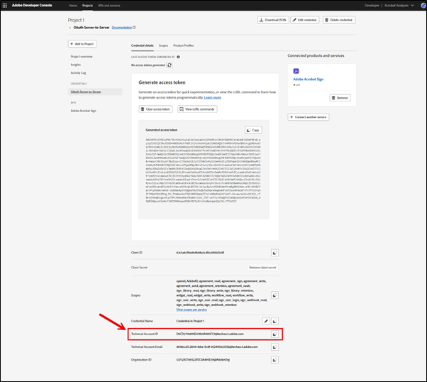

#### Step 2: Identify the end users to be allowlisted

- Collect the exact email addresses of the end users the Technical Account needs to act on behalf of.
- Verify that each user belongs to the same organization as the Technical Account.

On-behalf access will be rejected if:

- The user belongs to a different organization.
- The email address does not exactly match the user's account.

Carefully validate all email addresses before you submit the request.

#### Step 3: Submit a support ticket to add allowlist users

Adobe Support manages allowlisting to enforce governance and security controls.

- The System Administrator of the customer account must submit a support ticket that includes:
  - The Technical Account ID (ending in `@techacct.adobe.com`).
  - The full list of end-user email addresses to be allowlisted.
  - Confirmation of approval from your organization's System Administrator.
- Adobe reviews the request and configures the allowlist for that Technical Account.

Important:

- Make at least one successful API call using the Technical Account before Adobe can update its settings. The initial API call activates and fully provisions the Technical Account in the system.

Once approved:

- The Technical Account can access the allowlisted users' data.
- Include the `x-on-behalf-user` header in API requests with the approved user's email address.

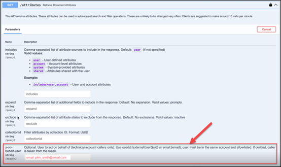

