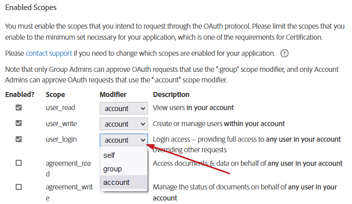

# Create an Application Quickstart

## Create an app in the web UI

To use Acrobat Sign APIs, create an application.

1. [Log in to Acrobat Sign.](https://secure.adobesign.com/public/login)
2. Select **API** from the top menu. If you are already an enterprise customer, you may not see the API link. In that case, choose **Account**.
3. Select **API Applications**.


4. Select the **Create** (+) icon and provide details about your app.
5. Choose a domain based on the intended use:

-  **CUSTOMER**: Apps that only access your account or are used for internal use and testing.
-  **PARTNER**: Select this type if you’re developing an application for other users and your app needs access to other Acrobat Sign accounts.

<InlineAlert slots="text" />

PARTNER applications [must be certified](https://www.adobe.com/go/esign-dev-cert) to have full access to other accounts.


### Get the app ID and secret

1. Select **API Applications** to view your app list.
2. Select your app to view its action menu.


3. Select **View/Edit** to get the application ID and secret.
4. Save the app’s application ID and secret. You’ll use this information to issue access tokens in the Acrobat Sign API.

<InlineAlert slots="text" />

Your new partner application is *uncertified* until you complete the partner certification process. You will be able to test the process of getting Acrobat Sign accounts connected to it by changing certain settings in the test/customer account (described below).

<video width="680" controls>
  <source src="https://images-tv.adobe.com/mpcv3/4413/413f8211-dffd-468c-9840-29c3fd463997_1597088990.854x480at800_h264.mp4" type="video/mp4" />
  Your browser does not support the video tag.
</video>

### Configure OAuth

The OAuth process requires that the client application request permissions from the end user before performing any actions on their behalf. The workflow redirects users to the Acrobat Sign application where they authenticate and grant the requested permissions. Acrobat Sign then redirects users back to the client application. Acrobat Sign uses the [OAuth 2.0 authentication protocol](https://tools.ietf.org/html/rfc6749) to authorize requests for any Sign API endpoint.

Once you have created your application, configure OAuth as follows:

1. Click **Configure OAuth for the Application** link to configure your OAuth integration.
2. Specify a secure (https) redirect URL to your servers/website (see [Configure the redirect URI on your server](gstarted.md#configure-the-redirect-uri-on-your-server)).

### Configure Scopes

You now need to add the permissions and scopes needed by your app when it interacts with the Sign APIs. Scopes describe what resources and actions your application will access. If you apply for Certification, Adobe will review the enabled scopes to confirm that they match the intended application use.

Your application’s OAuth authorization requests include a scope parameter describing the permissions. Note the following:

-  The requested scopes must be a subset of the scopes that are enabled for the application.
-  The requested scopes must be appropriate for the action the user is attempting to perform.
-  The user will be asked to authorize the requested permissions for your application.

When your application makes API calls using the access token, the calls must be permitted by the scopes associated with the access token. For example, to call GET /agreements, the <span style="color: red;">agreement_read</span> scope must have been requested and authorized.

While this screen sets the max allowable scopes, every token does not exercise them all. You can create different tokens for various users, and specific scenarios may use one or more of the scopes. Limit the scopes to those that you intend to request through OAuth. For example, <span style="color: red;">agreement_send:account user_login:self</span> would allow the application to send on behalf of any user in the account and also log in on behalf of the user that authorized the request.

<InlineAlert slots="text" />

Only Group Admins can approve OAuth requests that use the <span style="color: red;">:group</span> scope modifier, and only account admins can approve OAuth requests that use the <span style="color: red;">:account</span> scope modifier.

<InlineAlert slots="text" />

It is often easier to enable everything during development since it is easy to adjust later.

To set the scopes:

1. Check the **Enabled** checkbox for each needed scope.
2. Set the modifier.
3. Choose **Save**.



The following modifiers are available:

<div>
<table border="1" columnWidths="20,80" >
  <thead>
    <tr>
      <th>Modifier</th>
      <th>Description</th>
    </tr>
  </thead>
  <tbody>
    <tr>
      <td>self</td>
      <td>Perform the specified action on behalf of the authorizing user. This is the default: for example, <span style="color: red;">agreement_send:self</span> is the same scope as <span style="color: red;">agreement_send</span>.</td>
    </tr>
    <tr>
      <td>group</td>
      <td>Perform the specified action on behalf of any user in the same group as the authorizing user. The authorizing user must be a group admin to grant this scope and must have the Business or Enterprise edition of Acrobat Sign.</td>
    </tr>
    <tr>
      <td>account</td>
      <td>Perform the specified action on behalf of any user in the same account as the authorizing user. The authorizing user must be an account admin to grant this scope and must have the Business or Enterprise edition of Acrobat Sign.</td>
    </tr>
  </tbody>
</table>
</div>

## Create an authorization request link

Your app must include a link your customers use to initiate the OAuth request process. The OAuth process starts with the client directing the user’s browser request to the /public/oauth/v2 endpoint with the requisite query string parameters. You are simply invoking the Acrobat Sign APIs here. For example:

For partner apps the Base URI (Acrobat Sign endpoint) should NOT contain the “shard” of an account (i.e.: na1, na2, eu1, jp1, etc.)

```http
https://secure.echosign.com/public/oauth?
   redirect_uri=https://your-oAuthInteraction-Server/your-oAuth-Page.html&
   response_type=code&
   client_id=xxxxxxxxxx&
   state=xxxxxxxxxx&
   scope=user_read:account+user_write:account+user_login:account+agreement_read:account+agreement_write:account+agreement_send:account+widget_read:account+widget_write:account+library_read:account+library_write:account+workflow_read:account+workflow_write:account
```

<table border="1" columnWidths="20,30,10,40" >
    <thead>
        <tr>
            <th>Parameter</th>
            <th>Value</th>
            <th>Required?</th>
            <th>Description</th>
        </tr>
    </thead>
    <tbody>
        <tr>
            <td>response_type</td>
            <td>code</td>
            <td>Yes</td>
            <td>The value must always be <em>code</em>. Tells the process you’re looking for the OAuth code on the redirect URI once your customer logs in and accepts the auth permissions.</td>
        </tr>
        <tr>
            <td>client_id</td>
            <td>Your ID obtained from the OAuth configuration page.</td>
            <td>Yes</td>
            <td>Identifies to Acrobat Sign what application your customer is requesting a token for (the one for your app/platform).</td>
        </tr>
        <tr>
            <td>redirect_uri</td>
            <td>Your custom, secure, and absolute URI; for example, <a href="https://your-oAuthInteraction-Server/your-oAuth-Page.html">https://your-oAuthInteraction-Server/your-oAuth-Page.html</a>.</td>
            <td>Yes</td>
            <td>Redirects users here at the end of the authorization process. The value must belong to the set of values specified on the OAuth Configuration page.</td>
        </tr>
        <tr>
            <td>scope</td>
            <td>A space-delimited set of permissions specified during the OAuth configuration setup on the Configure OAuth page.</td>
            <td>Yes</td>
            <td>The permissions that the user will be asked to approve.</td>
        </tr>
        <tr>
            <td>state</td>
            <td>Any string</td>
            <td>No</td>
            <td>This value returns to the client as a parameter at the end of the authorization process. While not required, use of the <span style="color: red;">state</span> parameter <em>is highly recommended</em> to protect against CSRF <a href="https://tools.ietf.org/html/rfc6749#section-10.12">as described in the RFC</a>. You can use it to pass a unique ID that will be passed to the redirect URI so your system knows which client/instance requested the token and where to save it inside your platform.</td>
        </tr>
    </tbody>
</table>

## Configure the redirect URI on your server

Next, create a public redirect URI on your servers that captures the account details and code sent from your app’s authorization request so that the workflow connects to the customer’s Acrobat Sign account. The request URL that links your customer’s app instance to the Acrobat Sign account contains the permission parameters and account level (self, group, or account) that your API integration needs to enable the specified actions.


The redirect URI specified in your OAuth requests must belong to this list of URIs. You can mention multiple URIs as comma separated list.

1. Select **Configure OAuth for Application**.
2. Enter your URL.
3. Before continuing, set the scopes as described below.

<InlineAlert slots="text" />

If you’re building a partner app and would like to learn more about using redirects, see [What’s needed on the redirect URI page](https://www.evernote.com/shard/s517/client/snv?noteGuid=4dcab9ae-99ea-4ad4-ae98-ffb86f95ebf9&amp;noteKey=5f43b16e95b2329d&amp;sn=https%3A%2F%2Fwww.evernote.com%2Fshard%2Fs517%2Fsh%2F4dcab9ae-99ea-4ad4-ae98-ffb86f95ebf9%2F5f43b16e95b2329d&amp;title=What%25E2%2580%2599s%2Bneeded%2Bon%2Bthe%2B%25E2%2580%259Credirect%2BURI%25E2%2580%259D%2Bpage%253F)?

## Success vs failure

When your customer initiates the OAuth process by clicking your app’s Sign link, their browser redirects to the <span style="color: red;">redirect_uri</span> specified in the initial request. Query string parameters are added to indicate whether the request succeed or failed.

***Success***

<table border="1" columnWidths="20,80">
    <thead>
        <tr>
            <th><strong>Parameter</strong></th>
            <th><strong>Value</strong></th>
        </tr>
    </thead>
    <tbody>
        <tr>
            <td>code</td>
            <td>The authorization code which the client must use when requesting access tokens.</td>
        </tr>
        <tr>
            <td>state</td>
            <td>The value of state initially passed in, if any.</td>
        </tr>
    </tbody>
</table>

***Failure***

<table border="1" columnWidths="20,80">
    <thead>
        <tr>
            <th><strong>Parameter</strong></th>
            <th><strong>Value</strong></th>
        </tr>
    </thead>
    <tbody>
        <tr>
            <td>error</td>
            <td>
                <ul>
                    <li><strong>INVALID_REQUEST</strong>: The request is not well-formed due to missing or invalid parameters.</li>
                    <li><strong>UNAUTHORIZED_CLIENT</strong>: OAuth is not enabled for this application or the application isn’t active.</li>
                    <li><strong>INVALID_SCOPE</strong>: The requested scopes are not syntactically valid.</li>
                    <li><strong>ACCESS_DENIED</strong>: The user declined to grant access or wasn’t able to (for example, they weren’t an admin).</li>
                    <li><strong>SERVER_ERROR</strong>: An internal error occurred while processing the request.</li>
                </ul>
            </td>
        </tr>
        <tr>
            <td>state</td>
            <td>The value of state initially passed in, if any.</td>
        </tr>
    </tbody>
</table>

## The customer experience

<InlineAlert slots="text" />

Try out the [live demo](https://secure.na1.adobesign.com/public/oauthDemo).

1. Customers are routed to Acrobat Sign’s main log in page if they are not already logged in.
2. After signing in, a confirmation screen appears.
3. When the user selects **Allow Access**, the page redirects to the URL defined on your server (see above). The process adds the query string parameters the app needs to retrieve the refresh and access tokens for making API calls.


```http
https://your-oauthinteraction-server/your-oAuth-Page.html?
code=CBNCKBAAHBCAABAApvoU1TLVOj_GuGynhtExjJbQNOmst9KP&
api_access_point=https%3A%2F%2Fapi.na1.echosign.com%2F&
state=uhuhygtf576534&
web_access_point=https%3A%2F%2Fsecure.na1.echosign.com%2F
```

<table border="1" columnWidths="30,70">
    <thead>
        <tr>
            <th><strong>Name</strong></th>
            <th><strong>Description</strong></th>
        </tr>
    </thead>
    <tbody>
        <tr>
            <td><strong>code</strong></td>
            <td>In this example, CBNCKBAAHBCAABAApvoU1TLVOj_GuGynhtExjJbQNOmst9KP is the code your system uses to make the actual API call to get tokens. <strong>It is valid for only 5 minutes.</strong></td>
        </tr>
        <tr>
            <td><strong>api_access_point</strong></td>
            <td>The encoded URL which is the base URL for the account where you will need to start your REST calls for uploading docs, creating templates, getting agreement “views”, sending agreements, etc. The <span style="color: red;">.na1.</span> part tells your system which “shard” the customer’s application resides. Adobe uses AWS and AZURE to host the product, and customer’s accounts may be on one of many shards in various geo-locations. Once you have tokens you need to make all your REST calls to the shard where their account lives.</td>
        </tr>
        <tr>
            <td><strong>state</strong></td>
            <td>The string your system provided which identifies the instance of your application/platform making this request. <span style="color: red;">state</span> provides a way for you to return your customer to the app as well as know for which app instance you need to store tokens.</td>
        </tr>
        <tr>
            <td><strong>web_access_point</strong></td>
            <td>The URL where your customer logs in.</td>
        </tr>
    </tbody>
</table>

## Getting the access token

If the previous steps succeeded, request an access token by sending the authorization code along with the client ID and client secret to the Sign service. The client makes an HTTP POST to the /oauth/v2/token endpoint (using [https://api.na1.adobesign.com](https://api.na1.adobesign.com)) with the following parameters in the post body (not through query parameters):

```http
POST /oauth/token HTTP/1.1
Host: api.na1.adobesign.com
Content-Type: application/x-www-form-urlencoded
Cache-Control: no-cache

  grant_type=authorization_code&
  code=CBNCKBAThIsIsNoTaReAlcs_sL4K32wCzs4N&
  client_id=xxxxxxxxxx&
  client_secret=xxxxxxxxxx&
  redirect_uri=https://myserver.com HTTP/1.1
```

The response returns the following JSON body containing the access token and the refresh token:

```json
{
   "access_token":"3AAABLblThIsIsNoTaReAlToKeNPr6Cv8KcZ9p7E93k2Tf",
   "refresh_token":"3AAABLblThIsIsNoTaReAlToKeNWsLa2ZBVpD0uc*",
   "token_type":"Bearer",
   "expires_in":3600,
   "api_access_point ":"https://api.na1.adobesign.com/",
   "web_access_point":" https://secure.na1.adobesign.com/"
}
```

<table border="1" columnWidths="30,70">
    <thead>
        <tr style="background-color: #e0e0e0;">
            <th><strong>Name</strong></th>
            <th><strong>Value</strong></th>
        </tr>
    </thead>
    <tbody>
        <tr>
            <td><strong>access_token</strong></td>
            <td>Use this token to access any Acrobat Sign API endpoint.</td>
        </tr>
        <tr>
            <td><strong>refresh_token</strong></td>
            <td>If your access token expires, use the refresh token to request a new access token. Keep your client ID and secret handy to request a new access token from a refresh token.</td>
        </tr>
        <tr>
            <td><strong>token_type</strong></td>
            <td>Always “Bearer”</td>
        </tr>
        <tr>
            <td><strong>expires_in</strong></td>
            <td>The number of milliseconds in which the access token expires.</td>
        </tr>
        <tr>
            <td><strong>api_access_point</strong></td>
            <td>Use this endpoint for Sign API access; it’s the base URI to be used for subsequent calls (/oauth/v2/refresh and /oauth/v2/revoke).</td>
        </tr>
        <tr>
            <td><strong>web_access_point</strong></td>
            <td>Use this endpoint to open Sign Web, e.g. web_access_point + “/public/login” OR web_access_point + “/public/logout”.</td>
        </tr>
    </tbody>
</table>
