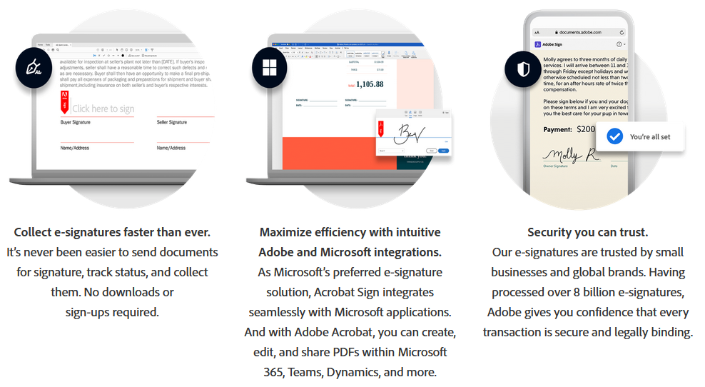
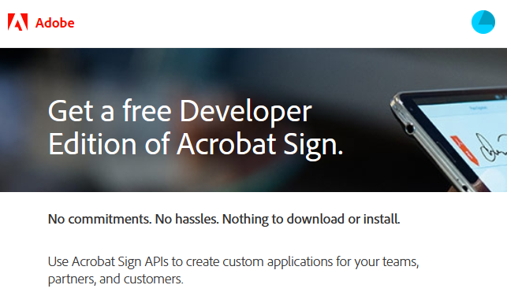
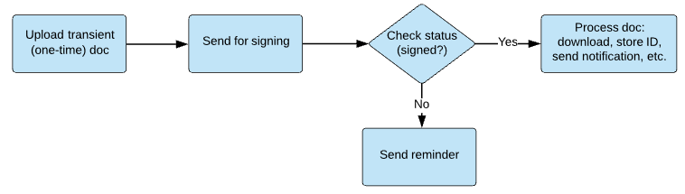

# Acrobat Sign API Overview

##

Welcome to the Acrobat Sign developer documentation. The details here help you create and manage signing workflows for your organization and customers. It provides essential tools to help you leverage Adobe’s broad developer and product ecosystem, including PDF, Acrobat, and other products across mobile devices, the desktop and the web.

<InlineAlert slots="text" />

If you’re ready to create a developer account and start crafting your first app, jump to [Create an Application Quickstart](gstarted.md#create-an-app-in-the-web-ui).

Acrobat Sign’s APIs allow you to create apps and embed the Acrobat Sign UI and functionality into your applications. Those apps can receive status updates in real-time as well as retrieve and store copies of the signed agreements. You can also build a variety of integrations with Acrobat Sign using just the APIs; for example, with Salesforce. These integrations allow you to start the Acrobat Sign experience entirely from within your external application.

Use the Acrobat Sign APIs to:

-  Create and manage agreements
-  Retrieve signed documents
-  Embed a signing UI in your app
-  Send reminders
-  Create widgets
-  Build reusable library documents
-  Batch send documents in bulk
-  Download audit trails
-  Archive signed documents
-  Leverage enterprise workflows in Acrobat across any device
-  And more!

## Get a free developer account

Adobe provides a free developer account via the Acrobat Sign Developer Edition. The Developer Edition supports:

-  Access to the Acrobat Sign API
-  Testing for document exchange and execution
-  Testing for emailing copies of signed agreements

Get started in minutes:

1. Create an Adobe ID if you don’t already have one.
2. Log in to your Adobe account.
3. [Sign up.](https://www.adobe.com/ca/sign/developer-form.html) Once completed, you’ll be able to create signing workflows. Test documents appear with a “test” lable.

<InlineAlert slots="text" />

If you’ll eventually use your enterprise ID in a production environment, you may want to create a separate Adobe ID for development and testing.

## Create an app

[Create an app in the web UI](gstarted.md#create-an-app-in-the-web-ui) to learn about the APIs and quickly ramp to production.

-  For real-world examples with additional details, see [Example Scenarios](scenarios.md).
-  Browse through the [REST API reference](https://www.adobe.com/go/acrobatsignapireference) to learn more about the request types, events, and so on.
-  Review your app’s features. A common workflow monitors the signing process from beginning to end:
   1. [Send for Signing (Create an agreement)](apiusage.md#send-for-signing-create-an-agreement)
   2. [Check the Document signing status](apiusage.md#check-the-document-signing-status)
   3. If the agreement remains unsigned, [Send Reminders](apiusage.md#send-reminders).
   4. If all the signers have signed, [Download the Agreement](apiusage.md#download-the-agreement).

