# Webhook APIs

## 

Webhook APIs are the means by which your integration communicates with the Acrobat Sign service about webhooks. Use the various API endpoints to create, delete, modify, and retrieve status information about your webhooks.

Acrobat Sign APIs include the endpoints described below.

## POST /webhooks

<br/>
<table border="1" columnWidths="30,70">
  <tr>
    <th>Entity</th>
    <th>Value</th>
  </tr>
  <tr>
    <td>Description</td>
    <td>Creates a webhook</td>
  </tr>
  <tr>
    <td>Endpoint operation</td>
    <td>/webhooks</td>
  </tr>
  <tr>
    <td>OAuth scopes</td>
    <td>webhook_write</td>
  </tr>
  <tr>
    <td>Request object</td>
    <td>
      <pre><code>
{`{
    "name": "",
    "scope": "",
    "state": "",
    "webhookSubscriptionEvents": [
      ""
    ],
    "webhookUrlInfo": {
      "url": ""
    },
    "applicationDisplayName": "",
    "applicationName": "",
    "created": "",
    "id": "",
    "lastModified": "",
    "resourceId": "",
    "resourceType": "",
    "status": "",
    "webhookConditionalParams": {
      "webhookAgreementEvents": {
          "includeDetailedInfo": false,
          "includeDocumentsInfo": false,
          "includeParticipantsInfo": false,
          "includeSignedDocuments": false
      },
      "webhookMegaSignEvents": {
          "includeDetailedInfo": false
      },
      "webhookWidgetEvents": {
          "includeDetailedInfo": false,
          "includeDocumentsInfo": false,
          "includeParticipantsInfo": false
      }
    }
}`}
      </code></pre>
    </td>
  </tr>
  <tr>
    <td>Response header</td>
    <td>Location Header specifying the resource location of the webhook</td>
  </tr>
  <tr>
    <td>Response content type</td>
    <td>application/json</td>
  </tr>
  <tr>
    <td>Response object</td>
    <td>WebhookCreationResponse <span style="color: red;"> &#123; "id" : "" &#125; </span></td>
  </tr>
  <tr>
    <td>HTTPS status code</td>
    <td>201</td>
  </tr>
</table>

**Error codes**

Please note that new errors could be returned from APIs or existing error codes can be evolved. Clients are expected to be prepared to do default handling for error scenarios which they do not understand.

***Error codes***

<br/>
<table border="1" columnWidths="10,50,40">
  <tr>
    <th>Code</th>
    <th>Error Code</th>
    <th>Message</th>
  </tr>
  <tr>
    <td>400</td>
    <td>INVALID_ARGUMENTS</td>
    <td>One or more arguments to the method are invalid.</td>
  </tr>
  <tr>
    <td>400</td>
    <td>INVALID_WEBHOOK_URL</td>
    <td>The Webhook URL specified is invalid.</td>
  </tr>
  <tr>
    <td>400</td>
    <td>INVALID_RESOURCE_ID</td>
    <td>Resource Id specified is invalid.</td>
  </tr>
  <tr>
    <td>400</td>
    <td>INVALID_RESOURCE_TYPE</td>
    <td>The resource type is invalid.</td>
  </tr>
  <tr>
    <td>400</td>
    <td>INVALID_WEBHOOK_CONDITIONAL_PARAMS</td>
    <td>The conditional parameters specified are invalid.</td>
  </tr>
  <tr>
    <td>400</td>
    <td>MISSING_REQUIRED_PARAM</td>
    <td>The required parameters are missing.</td>
  </tr>
  <tr>
    <td>400</td>
    <td>WEBHOOK_LIMIT_EXCEEDED</td>
    <td>This webhook can’t be created. The events array &#123; events &#125; has reached the maximum number of active webhooks.</td>
  </tr>
  <tr>
    <td>400</td>
    <td>DUPLICATE_WEBHOOK_CONFIGURATION</td>
    <td>There is already a webhook registered with the same configuration.</td>
  </tr>
  <tr>
    <td>400</td>
    <td>INVALID_WEBHOOK_STATE</td>
    <td>The webhook state specified is invalid.</td>
  </tr>
  <tr>
    <td>400</td>
    <td>INVALID_WEBHOOK_SUBSCRIPTION_EVENTS</td>
    <td>One or more webhook subscription events specified are invalid.</td>
  </tr>
  <tr>
    <td>403</td>
    <td>WEBHOOK_CREATION_NOT_ALLOWED</td>
    <td>Webhook creation is not allowed.</td>
  </tr>
</table>

This API will be used to create a webhook on a particular resource in Acrobat Sign.

- You need to register the webhook with your application and a user token using this API.
- Group level webhooks can only be created by a Group admin and Account level webhooks can only be created by an Account admin.
- The user can customize the events for which the webhook is triggered in this call.

The <span style="color: red;">HTTP Location</span> header field is returned in the response to provide information about the location of a newly created resource. Multiple webhooks can be created on a single resource. *Also, multiple webhooks can share the same URL*.

<InlineAlert slots="text" />

Acrobat Sign now includes a new Object <span style="color: red;">webhookEndpointInfo</span> to associate a webhook to a webhookEndpoint. When using the webhookEndpointInfo, do not provide a webhookUrlInfo.

```json
webhookInfo {
...
  webhookEndpointInfo : {
    webhookEndpointId: "",
    domainPrefix: "",
    urlSuffix: ""
  }
}
```

<br/>
<table border="1" columnWidths="20,80">
  <tr>
    <th>Attribute</th>
    <th>Description</th>
  </tr>
  <tr>
    <td>webhookEndpointId</td>
    <td>The webhookEndpointId that is to be associated with this webhook.</td>
  </tr>
  <tr>
    <td>domainPrefix</td>
    <td>Optional URL subdomain value. This value will be used to replace the first wildcard (*).</td>
  </tr>
  <tr>
    <td>urlSuffix</td>
    <td>Optional URL suffix to append to the WebhookEndpointId. This value will be used to replace the wildcard (*) at the end.</td>
  </tr>
</table>

**webhookEndpointInfo Error codes**

You should be prepared to handle new errors that may be returned from APIs or changes in existing error codes. It is important to note that error codes can evolve over time. You must be prepared to implement default error handling for unclear error events.

<br/>
<table border="1" columnWidths="10,60,30">
  <tr>
    <th>Code</th>
    <th>Error Code</th>
    <th>Message</th>
  </tr>
  <tr>
    <td>400</td>
    <td>INVALID_JSON</td>
    <td>An invalid JSON was specified.</td>
  </tr>
  <tr>
    <td>404</td>
    <td>INVALID_WEBHOOK_ENDPOINT_ID</td>
    <td>WebhookEndpointId is not found. Request id: &lt;hash&gt;</td>
  </tr>
</table>

## GET /webhooks

<br/>
<table border="1" columnWidths="20,80">
  <tr>
    <th>Entity</th>
    <th>Value</th>
  </tr>
  <tr>
    <td>Description</td>
    <td>Get a list of webhooks created by the access token user</td>
  </tr>
  <tr>
    <td>OAuth scopes</td>
    <td>webhook_read</td>
  </tr>
  <tr>
    <td>Query parameters</td>
    <td>
     <ul>
      <li><span style="color: red;">showInactiveWebhooks</span>: boolean: A query parameter to fetch all the inactive webhooks along with the active webhooks.</li>
      <li><span style="color: red;">scope</span>: Scope of the webhook. The possible values are <span style="color: red;">ACCOUNT</span>, <span style="color: red;">GROUP</span>, <span style="color: red;">USER</span>, or <span style="color: red;">RESOURCE</span>.</li>
      <li><span style="color: red;">resourceType</span>: The type of resource on which webhook was created. The possible values are <span style="color: red;">AGREEMENT</span>, <span style="color: red;">WIDGET</span>, and <span style="color: red;">MEGASIGN</span>.</li>
    </ul>
    </td>
  </tr>
  <tr>
    <td>Response content type</td>
    <td>application/json</td>
  </tr>
  <tr>
    <td>Response object</td>
    <td>
    WebhooksInfo
    <pre><code>
    {`{
    "userWebhookList": [
      {
          "applicationName": "Application for REST Swagger Documentation",
          "applicationId": "pUQL757H2R2",
          "id": "CBJCHBCAABAAtW5qb_gRDgssqn6tvLvCcav0VqYi0WTR",
          "name": "user level webhook",
          "lastModified": "2018-02-06T22:52:27-08:00",
          "scope": "USER",
          "webhookSubscriptionEvents": [
            "AGREEMENT_RECALLED"
          ],
          "webhookUrlInfo": {
            "url": "https://testUrl"
          },
          "status": "ACTIVE"
      },
      {
          "applicationName": "Application for REST Swagger Documentation",
          "applicationDisplayName ": "REST Swagger",
          "id": "CBJCHBCAABAAtW5qb_gRDgssqn6tvLvCcav0VqYi0WTR",
          "name": "webhook linked to a webhookEndpoint",
          "lastModified": "2018-02-06T22:52:27-08:00",
          "scope": "RESOURCE",
          "resourceType": "AGREEMENT",
          "resourceId": "3dffwifvgvfguierfreokfperfprfppr",
          "webhookSubscriptionEvents": [
            "AGREEMENT_RECALLED"
          ],
          "status": "ACTIVE",
          "webhookEndpointInfo": {
            "webhookEndpointId": "",
            "domainPrefix": "",
            "urlSuffix": ""
          }
      }
    ],
    "page": {
      "nextCursor": " "
    }
}`}</code></pre>
    </td>
  </tr>
  <tr>
    <td>HTTPS status code</td>
    <td>200</td>
  </tr>
</table>

**Error codes**

Please note that new errors could be returned from APIs or existing error codes can be evolved. Clients are expected to be prepared to do default handling for error scenarios which they do not understand.

***Error codes***

<br/>
<table border="1" columnWidths="10,30,60">
  <tr>
    <th>HTTPS Status Code</th>
    <th>Error Code</th>
    <th>Message</th>
  </tr>
  <tr>
    <td>400</td>
    <td>INVALID_ARGUMENTS</td>
    <td>One or more arguments to the method are invalid.</td>
  </tr>
  <tr>
    <td>400</td>
    <td>INVALID_CURSOR</td>
    <td>The page cursor provided is invalid.</td>
  </tr>
  <tr>
    <td>400</td>
    <td>INVALID_PAGE_SIZE</td>
    <td>Page size is either invalid or not within the permissible range.</td>
  </tr>
</table>

## GET /webhooks/{webhookId}

<br/>
<table border="1" columnWidths="20,80">
  <tr>
    <th>Entity</th>
    <th>Value</th>
  </tr>
  <tr>
    <td>Description</td>
    <td>List details of a webhook.</td>
  </tr>
  <tr>
    <td>Endpoint operation</td>
    <td>/webhhooks/&#123;webhookId&#125;</td>
  </tr>
  <tr>
    <td>OAuth scopes</td>
    <td>webhook_read</td>
  </tr>
  <tr>
    <td>Response content type</td>
    <td>application/json</td>
  </tr>
  <tr>
    <td>Response object</td>
    <td>
      <pre><code>
  {`{
    "scope": "",
    "webhookSubscriptionEvents": [
        ""
    ],
    "webhookUrlInfo": {
        "url": ""
    },
    "name": "",
    "status": "",
    "applicationDisplayName ": "",
    "applicationName": "",
    "created": "date",
    "id": "",
    "lastModified": "date",
    "resourceId": "",
    "resourceType": "",
    "webhookConditionalParams": {
        "webhookAgreementEvents": {
            "includeDetailedInfo": false,
            "includeDocumentsInfo": false,
            "includeParticipantsInfo": false,
            "includeSignedDocuments": false
        },
        "webhookMegaSignEvents": {
            "includeDetailedInfo": false
        },
        "webhookWidgetEvents": {
            "includeDetailedInfo": false,
            "includeDocumentsInfo": false,
            "includeParticipantsInfo": false
        }
    }
  }`}
      </code></pre>
    </td>
  </tr>
  <tr>
    <td>HTTPS status code</td>
    <td>200</td>
  </tr>
</table>

**Error codes**

Please note that new errors could be returned from APIs or existing error codes can be evolved. Clients are expected to be prepared to do default handling for error scenarios which they do not understand.

***Error codes***

<br/>
<table border="1" columnWidths="10,40,50">
  <tr>
    <th>Code</th>
    <th>Error code</th>
    <th>Message</th>
  </tr>
  <tr>
    <td>304</td>
    <td>RESOURCE_NOT_MODIFIED</td>
    <td>The resource is not modified.</td>
  </tr>
  <tr>
    <td>404</td>
    <td>INVALID_WEBHOOK_ID</td>
    <td>The webhookId specified is invalid.</td>
  </tr>
</table>

<InlineAlert slots="text" />

You can update a webhook that is linked to webhookEndpoint by providing the webhookEndpointInfo in the Request body.

```json
"userWebhookList": [
      {
          ...
          "webhookEndpointInfo": {
              "webhookEndpointId": "",
              "domainPrefix": "",
              "urlSuffix": ""
          }
      },
```

## PUT /webhooks/{webhookId}

<br/>
<table border="1" columnWidths="20,80">
  <tr>
    <th>Entity</th>
    <th>Value</th>
  </tr>
  <tr>
    <td>Description</td>
    <td>This endpoint is used to update the webhook resource.</td>
  </tr>
  <tr>
    <td>Endpoint operation</td>
    <td>/webhooks/&#123;webhookId&#125;</td>
  </tr>
  <tr>
    <td>OAuth scopes</td>
    <td>webhook_write</td>
  </tr>
  <tr>
    <td>Request header</td>
    <td>Standard header. Additionally, If-Match headers, which will be processed as per the Concurrency section of the DC API Guideline.</td>
  </tr>
  <tr>
    <td>Request body</td>
    <td>
      <pre><code>{`{
  "name": "",
  "scope": "",
  "state": "",
  "webhookSubscriptionEvents": [
    ""
  ],
  "webhookUrlInfo": {
    "url": ""
  },
  "applicationDisplayName": "",
  "applicationName": "",
  "created": "",
  "id": "",
  "lastModified": "",
  "resourceId": "",
  "resourceType": "",
  "status": "",
  "webhookConditionalParams": {
    "webhookAgreementEvents": {
        "includeDetailedInfo": false,
        "includeDocumentsInfo": false,
        "includeParticipantsInfo": false,
        "includeSignedDocuments": false
    },
    "webhookMegaSignEvents": {
        "includeDetailedInfo": false
    },
    "webhookWidgetEvents": {
        "includeDetailedInfo": false,
        "includeDocumentsInfo": false,
        "includeParticipantsInfo": false
    }
  }
}`}</code></pre>
    </td>
  </tr>
  <tr>
    <td>Response content type</td>
    <td>application/json</td>
  </tr>
  <tr>
    <td>Response object</td>
    <td>Empty response</td>
  </tr>
  <tr>
    <td>HTTPS status code</td>
    <td>204</td>
  </tr>
</table>

**Error codes**

Please note that new errors could be returned from APIs or existing error codes can be evolved. Clients are expected to be prepared to do default handling for error scenarios which they do not understand.

***Error codes***

<br/>
<table border="1" columnWidths="10,50,40">
  <tr>
    <th>HTTPS Status Code</th>
    <th>Error Code</th>
    <th>Message</th>
  </tr>
  <tr>
    <td>400</td>
    <td><span style="color: red;">MISSING_REQUIRED_PARAM</span></td>
    <td>Required parameters are missing.</td>
  </tr>
  <tr>
    <td>400</td>
    <td><span style="color: red;">DUPLICATE_WEBHOOK_CONFIGURATION</span></td>
    <td>There is already a webhook registered with same configuration.</td>
  </tr>
  <tr>
    <td>400</td>
    <td><span style="color: red;">INVALID_JSON</span></td>
    <td>An invalid JSON was specified.</td>
  </tr>
  <tr>
    <td>400</td>
    <td><span style="color: red;">INVALID_WEBHOOK_CONDITIONAL_PARAMS</span></td>
    <td>The webhook conditional parameters specified are invalid.</td>
  </tr>
  <tr>
    <td>400</td>
    <td><span style="color: red;">INVALID_WEBHOOK_SUBSCRIPTION_EVENTS</span></td>
    <td>One or more webhook subscription events specified are invalid.</td>
  </tr>
  <tr>
    <td>400</td>
    <td><span style="color: red;">MISSING_IF_MATCH_HEADER</span></td>
    <td>The If-Match header missing.</td>
  </tr>
  <tr>
    <td>400</td>
    <td><span style="color: red;">UPDATE_NOT_ALLOWED</span></td>
    <td>The webhook you are trying to update cannot be modified.</td>
  </tr>
  <tr>
    <td>400</td>
    <td><span style="color: red;">WEBHOOK_LIMIT_EXCEEDED</span></td>
    <td>This webhook can’t be activated. The resource has reached the maximum number of active webhooks.</td>
  </tr>
  <tr>
    <td>404</td>
    <td><span style="color: red;">INVALID_WEBHOOK_ID</span></td>
    <td>The <span style="color: red;">webhookId</span> is invalid.</td>
  </tr>
  <tr>
    <td>412</td>
    <td><span style="color: red;">RESOURCE_MODIFIED</span></td>
    <td>The resource is already modified with a newer version.</td>
  </tr>
</table>

Only events and conditional parameters can be modified. The webhook URL can’t be modified once the webhook is created. The modification can also be done in the INACTIVE state.

<InlineAlert slots="text" />

You can update a webhook that is linked to webhookEndpoint by providing the webhookEndpointInfo in the Request body.

```json
webhookInfo {
...
  webhookEndpointInfo : {
    webhookEndpointId: "",
    domainPrefix: "",
    urlSuffix: ""
  }
}
```

## PUT /webhooks/{webhookId}/state

<br/>
<table border="1" columnWidths="20,80">
  <tr>
    <th>Entity</th>
    <th>Value</th>
  </tr>
  <tr>
    <td>Description</td>
    <td>This endpoint will update the state of a webhook identified by webhookId in the path.</td>
  </tr>
  <tr>
    <td>Endpoint operation</td>
    <td>/webhooks/&#123;webhookId&#125;/state</td>
  </tr>
  <tr>
    <td>OAuth scopes</td>
    <td>webhook_write</td>
  </tr>
  <tr>
    <td>Request header</td>
    <td>Standard header. Additionally, If-Match headers, which will be processed as per the Concurrency section of the DC API Guidelines.</td>
  </tr>
  <tr>
    <td>Request body</td>
    <td>
      <span style="color: red;">&#123; "state": ""&#125;</span>
    </td>
  </tr>
  <tr>
    <td>Response content type</td>
    <td>application/json</td>
  </tr>
  <tr>
    <td>Response object</td>
    <td>Empty response</td>
  </tr>
  <tr>
    <td>HTTPS status code</td>
    <td>204</td>
  </tr>
</table>

**Error codes**

Please note that new errors could be returned from APIs or existing error codes can be evolved. Clients are expected to be prepared to do default handling for error scenarios which they do not understand.

***Error codes***

<br/>
<table border="1" columnWidths="10,50,40">
  <tr>
    <th>HTTPS status code</th>
    <th>Error code</th>
    <th>Message</th>
  </tr>
  <tr>
    <td>400</td>
    <td><span style="color: red;">MISSING_REQUIRED_PARAM</span></td>
    <td>Required parameters are missing.</td>
  </tr>
  <tr>
    <td>400</td>
    <td><span style="color: red;">DUPLICATE_WEBHOOK_CONFIGURATION</span></td>
    <td>There is already a webhook registered with the same configuration.</td>
  </tr>
  <tr>
    <td>400</td>
    <td><span style="color: red;">INVALID_JSON</span></td>
    <td>An invalid JSON was specified.</td>
  </tr>
  <tr>
    <td>400</td>
    <td><span style="color: red;">MISSING_IF_MATCH_HEADER</span></td>
    <td>The If-Match header is missing.</td>
  </tr>
  <tr>
    <td>400</td>
    <td><span style="color: red;">UPDATE_NOT_ALLOWED</span></td>
    <td>The webhook you are trying to update cannot be modified.</td>
  </tr>
  <tr>
    <td>400</td>
    <td><span style="color: red;">WEBHOOK_LIMIT_EXCEEDED</span></td>
    <td>This webhook can’t be activated. The resource has reached the maximum number of active webhooks.</td>
  </tr>
  <tr>
    <td>404</td>
    <td><span style="color: red;">INVALID_WEBHOOK_ID</span></td>
    <td>The <span style="color: red;">webhookId</span> is invalid.</td>
  </tr>
  <tr>
    <td>412</td>
    <td><span style="color: red;">RESOURCE_MODIFIED</span></td>
    <td>The resource is already modified with a newer version.</td>
  </tr>
</table>

## DELETE /webhooks/{webhookId}

<br/>
<table border="1" columnWidths="20,80">
  <tr>
    <th>Entity</th>
    <th>Value</th>
  </tr>
  <tr>
    <td>Description</td>
    <td>This endpoint is used to delete the webhook resource. This is the terminal state of the webhook and the action is irreversible.</td>
  </tr>
  <tr>
    <td>Endpoint operation</td>
    <td>/webhooks/&lbrace;webhookId&rbrace;</td>
  </tr>
  <tr>
    <td>OAuth scopes</td>
    <td>webhook_delete</td>
  </tr>
  <tr>
    <td>Request header</td>
    <td>Standard header</td>
  </tr>
  <tr>
    <td>HTTPS status code</td>
    <td>204</td>
  </tr>
</table>

**Error codes**

Please note that new errors could be returned from APIs or existing error codes can be evolved. Clients are expected to be prepared to do default handling for error scenarios which they do not understand.

***Error codes***

<br/>
<table border="1" columnWidths="10,40,50">
  <tr>
    <th>Code</th>
    <th>Error code</th>
    <th>Message</th>
  </tr>
  <tr>
    <td>403</td>
    <td>FORBIDDEN</td>
    <td>Delete is not allowed.</td>
  </tr>
  <tr>
    <td>404</td>
    <td>INVALID_WEBHOOK_ID</td>
    <td>The webhookId is invalid.</td>
  </tr>
</table>

## Standard API request error codes

Any API request may return any of these standard error codes:

<br/>
<table border="1" columnWidths="10,40,50">
  <tr>
    <th>HTTPS status code</th>
    <th>Error code</th>
    <th>Message</th>
  </tr>
  <tr>
    <td>400</td>
    <td><span style="color: red;">BAD_REQUEST</span></td>
    <td>The request provided is invalid.</td>
  </tr>
  <tr>
    <td>400</td>
    <td><span style="color: red;">INVALID_JSON</span></td>
    <td>An invalid JSON was specified.</td>
  </tr>
  <tr>
    <td>400</td>
    <td><span style="color: red;">INVALID_ON_BEHALF_OF_USER_HEADER</span></td>
    <td>The value provided in the <span style="color: red;">x-on-behalf-of-user</span> header is in invalid format.</td>
  </tr>
  <tr>
    <td>400</td>
    <td><span style="color: red;">INVALID_X_API_USER_HEADER</span></td>
    <td>The value provided in <span style="color: red;">x-api-user</span> header is in invalid format.</td>
  </tr>
  <tr>
    <td>400</td>
    <td><span style="color: red;">MISC_ERROR</span></td>
    <td>Some miscellaneous error has occurred.</td>
  </tr>
  <tr>
    <td>401</td>
    <td><span style="color: red;">UNAUTHORIZED</span></td>
    <td>You cannot work on behalf of this user.</td>
  </tr>
  <tr>
    <td>401</td>
    <td><span style="color: red;">UNVERIFIED_USER</span></td>
    <td>The user has registered but has not verified their email address. The user must use the Acrobat Sign website to complete verification.</td>
  </tr>
  <tr>
    <td>401</td>
    <td><span style="color: red;">NO_AUTHORIZATION_HEADER</span></td>
    <td>The authorization header was not provided.</td>
  </tr>
  <tr>
    <td>401</td>
    <td><span style="color: red;">INVALID_ACCESS_TOKEN</span></td>
    <td>The access token provided is invalid or has expired.</td>
  </tr>
  <tr>
    <td>401</td>
    <td><span style="color: red;">INVALID_USER</span></td>
    <td>An invalid user ID or email was provided in the <span style="color: red;">x-user header</span>.</td>
  </tr>
  <tr>
    <td>401</td>
    <td><span style="color: red;">INVALID_ON_BEHALF_OF_USER</span></td>
    <td>An invalid user ID or email was provided in the <span style="color: red;">x-on-behalf-of-user header</span>.</td>
  </tr>
  <tr>
    <td>403</td>
    <td><span style="color: red;">API_TERMS_NOT_ACCEPTED</span></td>
    <td>Your account is locked because an administrator has not agreed to Acrobat Sign’s Terms of Use. Please contact your administrator to activate your account.</td>
  </tr>
  <tr>
    <td>404</td>
    <td><span style="color: red;">PERMISSION_DENIED</span></td>
    <td>The API caller does not have the permission to execute this operation.</td>
  </tr>
  <tr>
    <td>500</td>
    <td><span style="color: red;">MISC_SERVER_ERROR</span></td>
    <td>Some miscellaneous server error has occurred.</td>
  </tr>
</table>

## Standard API request headers

Every API request will have the following standard headers. If Any API in the list above does not have one or more of the following headers, the API will explicitly document this fact.

<br/>
<table border="1" columnWidths="30,70">
  <tr>
    <th>Header Name</th>
    <th>Description</th>
  </tr>
  <tr>
    <td><span style="color: red;">AUTHORIZATION</span></td>
    <td>An access token with the correct scopes.</td>
  </tr>
  <tr>
    <td><span style="color: red;">x-api-user</span></td>
    <td>The userId or email of the API caller using the account or group token in the format <span style="color: red;">userid:&#123;userId&#125;</span> <b>OR</b> <span style="color: red;">email:&#123;email&#125;</span>. If it is not specified, then the caller is inferred from the token.</td>
  </tr>
  <tr>
    <td><span style="color: red;">x-on-behalf-of-user</span></td>
    <td>Account sharing: The user on whose behalf the API caller is working.</td>
  </tr>
</table>

## Using AWS Lambda Functions

AWS Lambda Functions is a serverless computing service offered by Amazon Web Services. AWS Lambda Functions offer you a platform in which you can execute function code on demand over the internet without the need to manage your own web servers. This gives you a no-overhead solution for hosting functions in the cloud, such as webhooks for Acrobat Sign. AWS Lambda Functions support Node.js (JavaScript), Java, Python, C#, and Go.

### Create an AWS Lambda function

To create an AWS Lambda function:

1. Login to your [AWS Management Console](https://aws.amazon.com/console/) and select the AWS Lambda service from the services list.

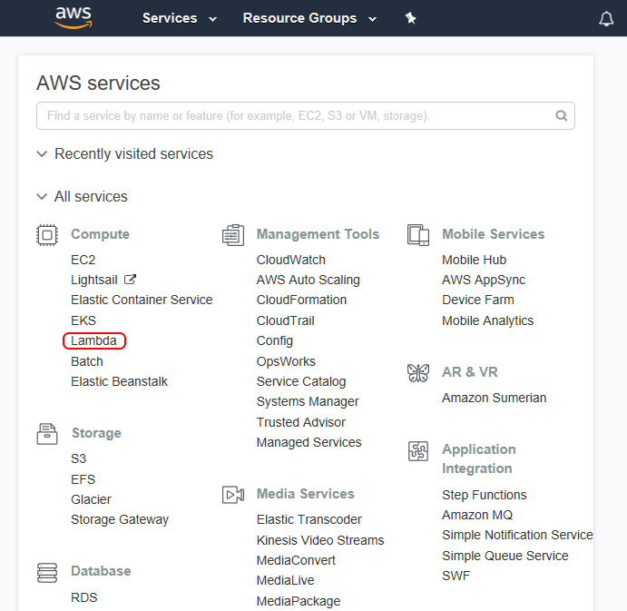

2. Choose to create a Lambda function, then select **Author from Scratch.**

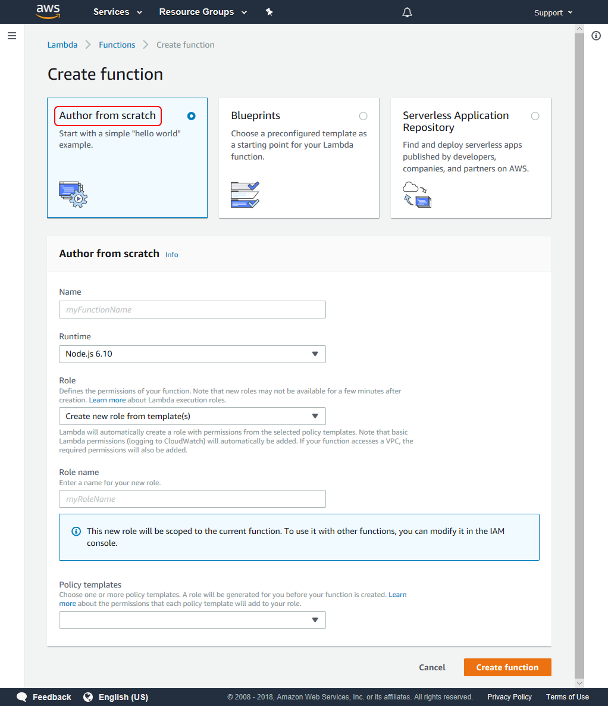

3. In the Configure function page, enter the function name “lambdaWebhooks” and select **Node.js 4.3** as the runtime.
4. For the role, choose an existing role or **Create a new role from template(s)**.
5. If you have chosen **Create new role from template(s)**, enter a role name (for instance, “role-lambda”) and select **Simple Microservice permissions** from the policy templates list.
6. Select **Create function.**
7. On the new AWS lambda function page, select **Edit code inline** as the code entry type; keep index.handler as the Handler.

### Register your Acrobat Sign webhook

Before registering a webhook, Acrobat Sign verifies that the webhook URL that is provided in the registration request really intends to receive notifications; see verifyintent. For this purpose, when a new webhook registration request is received by Acrobat Sign, it first makes an HTTPS GET verification request to the webhook URL with a custom HTTP header, <span style="color: red;">X-AdobeSign-ClientId</span>. The value in this header is set to the client ID of the application that is requesting to create and register the webhook. The webhook URL must respond to this verification request with a **2XX response code**, and it must send back the same client ID value in one of the following two ways: Also note the same behaviour for clientID is expected when the Webhook URL receives POST notifications.

**Case 1: Pass the client ID as X-AdobeSign-ClientId in the response header**

This is the same header which was passed in the request, and it must be echoed back in the response.

Replace the contents of the Index.js file with the following code snippet:

```javascript
exports.handler = function index(event, context, callback) {
  // Fetch client id
  var clientid = event.headers['X-AdobeSign-ClientId'];

  //Validate it
  if (clientid =="BGBQIIE7H253K6") //Replace 'BGBQIIE7H253K6' with the client id of the application using which the webhook is created
  {
    var response = {
        statusCode: 200,
        headers: {
            "X-AdobeSign-ClientId": clientid
        }
     };
   callback(null,response);
  }
  else {
   callback("Oops!! illegitimate call");
  }
}
```

**Case 2: Pass the client ID in the response body with the key xAdobeSignClientId**

In the JSON response body, pass the key <span style="color: red;">xAdobeSignClientId</span> with its value being the same client ID that was sent in the request header.

Replace the contents of the Index.js file with the following code snippet:

```javascript
exports.handler = function index(event, context, callback) {
 // Fetch client id
 var clientid = event.headers['X-AdobeSign-ClientId'];

 //Validate it
 if (clientid =="BGBQIIE7H253K6") //Replace 'BGBQIIE7H253K6' with the client id of the application using which the webhook is created
 {
   var responseBody = {
        xAdobeSignClientId : clientid
   };

    var response = {
        statusCode: 200,
        body: JSON.stringify(responseBody)

    };
   callback(null,response);
 }
 else {
   callback("Opps!! illegitimate call");
  }
}
```

Save the function. The Lambda function is created, and you are almost ready to use it in a real-time webhook.

### Configure the AWS API Gateway

To make this Lambda function publicly accessible through a HTTP method, you need to configure the AWS API Gateway using your function as the backend for the API.

1. In the AWS Management Console, select **API Gateway** from the AWS Services list.

Note: If this is your first time in the API Gateway console, you’ll see a Getting Started screen. Select Get Started to proceed. Clear the dialog for the example API. If you’ve used the API Gateway service before, simply select Create API to proceed.

2. In the Create new API page, select **New API** and enter **webhooks** as the **API name**.

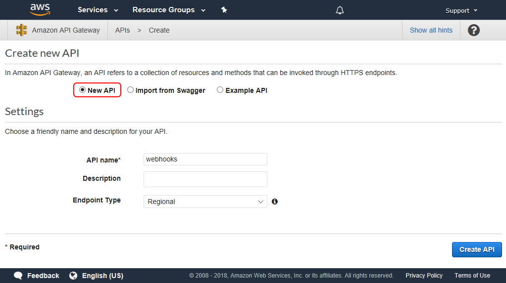

3. Select **Create API**.
4. From the Actions drop-down list, select **Create Resource**.
5. Check the “Configure as proxy resource” option and enter “validate” as the Resource Name and “{proxy+}” in the Resource Path.
6. Leave the “Enable API Gateway CORS” option unchecked and select **Create Resource**.
7. Keep the Lambda Function Proxy selected as the Integration type and select the region where you have created your Lambda function in the Lambda region drop-down list (probably it’s the same region where you are creating the API Gateway).
8. Enter “validate” as the Lambda Function and select **Save**.
9. An Add Permission to Lambda Function pop-up window appears; select **OK**.

If all the above steps are executed successfully, you’ll see something like this:

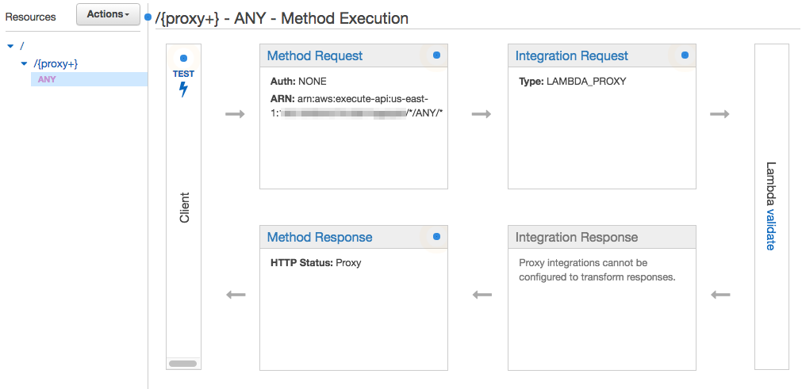

### Deploy the API

The next step is deploying this API so it becomes ready to use:

1. In the Actions drop-down, select **Deploy API**. The Deploy API dialog appears.
2. Select **[New Stage]** for the Deployment stage and enter “prod” (or anything you like to identify this stage) for the Stage name.
3. Select **Deploy**.

The new API is now ready to use. You can find the invoke URL in the blue box as shown below:

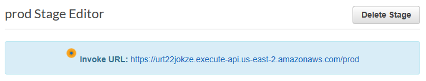

Take note of this URL as you’ll need to enter it as your real-time webhook URL.

### Ready to Use

It’s done. Use the above URL with “/{nodeJSfunctionName}” appended as the webhook URL in your <span style="color: red;">POST /webhooks</span> API request. Once you have verified the behavior, the webhook URL is functional as per Acrobat Sign standards. You can further update your new webhook and add custom logic as needed for your application.

## Using Azure Functions

Azure Functions is Microsoft’s serverless computing cloud platform. Using Azure Functions, you can write functional code and host it in the Azure cloud, ready to execute on demand. This always-on functionality, combined with the ease of management offered by cloud-based serverless architecture, makes Azure Functions a viable alternative for hosting your Acrobat Sign webhooks.

Azure Functions executes individual serverless functions within a function app. Function apps can host many different functions, and you can have many function apps on Azure; so the infrastructure enables you to organize related functions into apps.

### Prerequisites

To create and host a webhook in Azure Functions, you need:

1. A Microsoft account with license to create Azure Functions applications.

2. An Azure Functions app. If you don’t have an existing app, you can create it for the purpose: see [Create your first function in the Azure portal](https://docs.microsoft.com/en-us/azure/azure-functions/functions-create-first-azure-function) in the Azure documentation.

3. For this example, basic knowledge of JavaScript. Azure Functions understands and executes functions written in several different languages; see [Supported languages in Azure Functions](https://docs.microsoft.com/en-us/azure/azure-functions/supported-languages) in the Azure documentation.

### Creating an Azure Functions Trigger-Webhook

#### Create a JS HttpTrigger function

1. Login with your Microsoft account at [https://portal.azure.com/](https://portal.azure.com/)
2. Select Function Apps from your account dashboard menu. This will open your list of Azure Function apps.

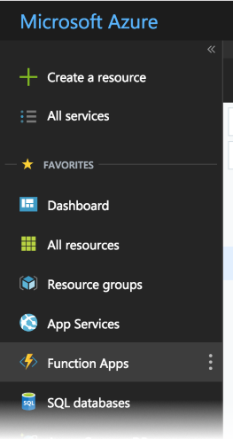

3. Choose the app wherein you want to create this new function.
4. Select the + icon to create a new Azure function.

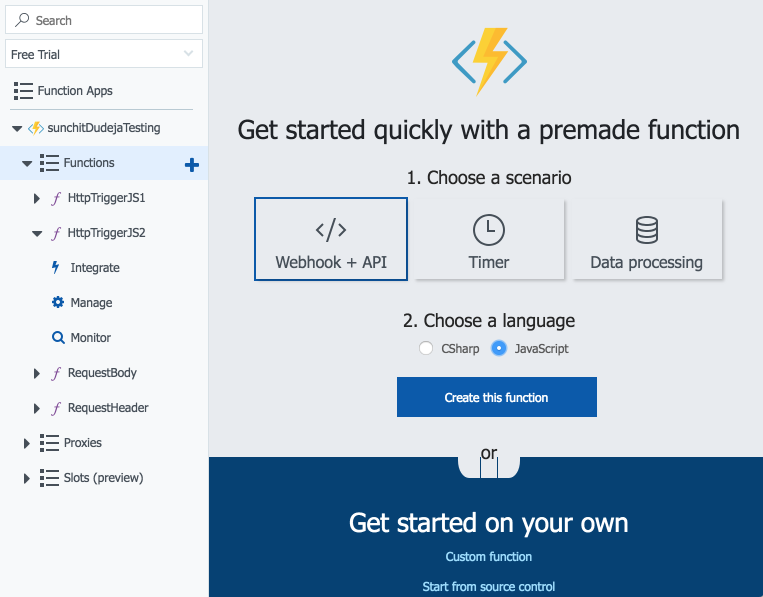

5. Select “Webhook + API” as the scenario and “JavaScript” as the language; then select “Create this function”.

This will create a new function that has the capability of handling incoming API requests.

#### Register the webhook

Register the webhook
Before registering a webhook successfully, Acrobat Sign verifies that the webhook URL that is provided in the registration request really intends to receive notifications; see verifyintent. For this purpose, when a new webhook registration request is received by Acrobat Sign, it first makes an HTTPS GET verification request to the webhook URL with a custom HTTP header, <span style="color: red;">X-AdobeSign-ClientId</span>. The value in this header is set to the client ID of the application that is requesting to create and register the webhook. The webhook URL must respond to this verification request with a **2XX response code**, and it must send back the same client ID value in one of the following two ways:

**Case 1: Pass the client ID as \`\`X-AdobeSign-ClientId\`\` in the response header**

This is the same header which was passed in the request, and it must be echoed back in the response.

1. Replace the contents of the index.js file with the following code snippet:

```javascript
module.exports = function (context, req) {
    var clientId = req.headers['x-adobesign-clientid'];
    // Validate that the incoming ClientID is genuine
    if (clientId === '123XXX456') {
        context.res = {
            // status: 200, /* Defaults to 200 */ // any 2XX response is acceptable
            body: "Notification Accepted",
            headers : {
                'x-adobesign-clientid' : req.headers['x-adobesign-clientid']
            }
        };
    }
    else {
        context.res = {
            status: 400,
            body: "Opps!! Illegitimate Call identified"
        };
    }
    context.done();
};
```

2. Test the behavior by mocking the request:

- Select the Test button at the extreme right corner.
- Mock the dummy request: 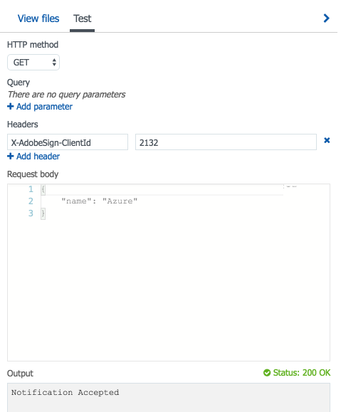

Although the response headers are not shown above, you can observe them by mocking the request with developer tools such as [Postman](https://www.postman.com/).

**Case 2: Pass the client ID in the response body with the key \`\`xAdobeSignClientId\`\`**

In the JSON response body, pass the key <span style="color: red;">xAdobeSignClientId</span> with its value being the same client ID that was sent in the request header.

1. Replace the index.js file with the following:


```javascript
module.exports = function (context, req) {
    var clientId = req.headers['x-adobesign-clientid'];
    // Validate that the incoming ClientID is genuine
    if (clientId === '123XXX456') {
        context.res = {
            // status: 200, /* Defaults to 200 */ // any 2XX response is acceptable
            body: {
                'xAdobeSignClientId' : clientId
            },
            headers : {
                'Content-Type' : 'application/json'
            }
        };
    }
    else {
        context.res = {
            status: 400,
            body: "Opps!! Illegitimate Call identified"
        };
    }
    context.done();
};
```

2. Test the behavior by mocking the request:

- Select the Test button at the extreme right corner
- Mock the dummy request

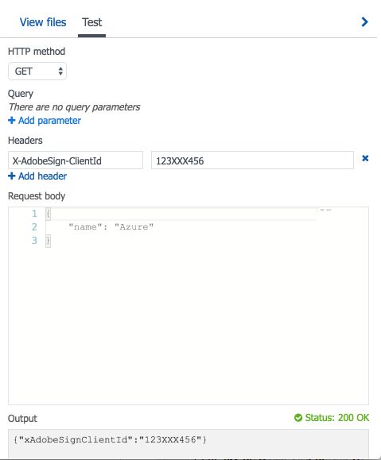

Note: The same behavior for <span style="color: red;">clientId</span> is expected when the Webhook URL receives POST notifications.

Once you have verified the behavior, the webhook URL is functional as per Acrobat Sign standards. You can further update your new webhook and add custom logic as needed for your application.

#### Get the function’s URL

1. Select **Get function URL:**

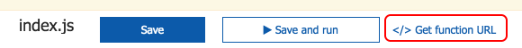

2. Copy the URL and use it for creating webhooks in Acrobat Sign.

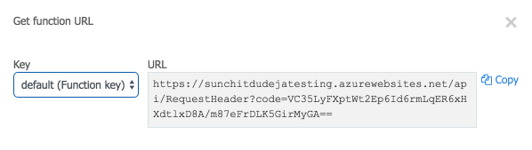
