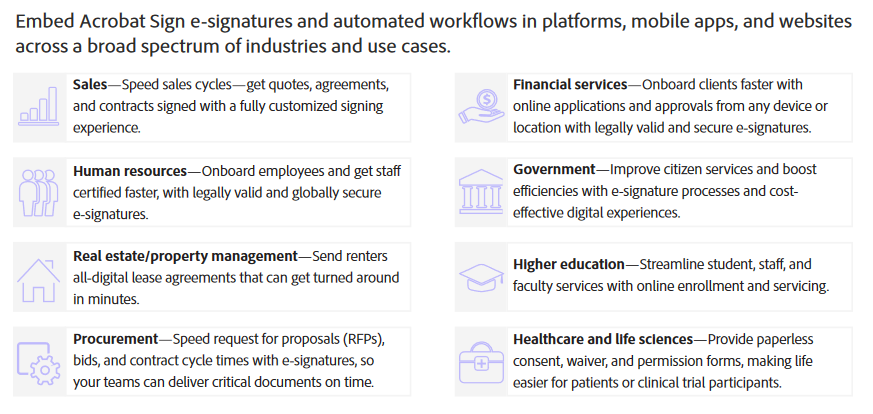
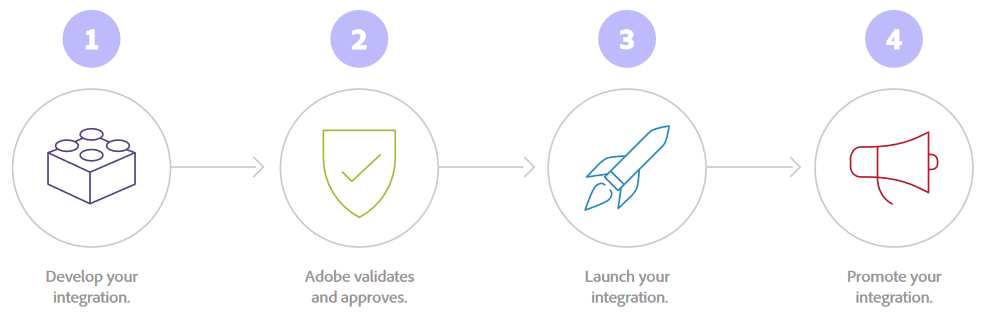

# Developing with Acrobat Sign Embed

Last update: Feb 06, 2025.

While most customers create and use a
single Acrobat Sign account, an embed partner is any entity whose end product
needs to access multiple Acrobat Sign accounts or initiates signing actions on
behalf of other customers. Embed partners develop integrations that reside
natively inside their application or platform for use by their customers.
Embed partners may resell Acrobat Sign transactions. [Contact
us](mailto:signembed%40adobe.com) to become an Acrobat Sign Embed partner. 

<InlineAlert slots="header, text" />

Tip

Alternatively, independent software vendors (ISVs) ([integration-only
partners](https://exchange.adobe.com/apps/browse/ec?product=SIGN&sort=MOST_RECENT))
provide integrations between Acrobat Sign and another application or service
for our shared customers. [Sign
up!](https://partners.adobe.com/exchangeprogram/documentcloud/prereg.html)

## Embed 2.0 updates:

**February 11, 2025**

 *   Updated swagger pages to indicate **me** as a shorthand for the accountId.
     
 *   A new **accountId** attribute added to all event notification payloads.
     
 *   Acrobat Sign Embed 2.0 partners can set up webhooks for their **channel** and accept asset notifications from each of their individual customer accounts.
     
 *   **New Settings APIs**
     
     *   POST /accounts/{accountId|me}/settings/search – Takes the identified account (accountId) and a list of setting names and returns the list of setting names with their values for the account specified. Only account-level values are returned.
         
         *   Available to non-admin users.
             
 *   PUT /accounts/{accountId|me}/settings - Applies a provided list of setting names and their values to the identified account (accountId).
     
 *   **New Logo APIs**
     
     *   POST /accounts/{accountId|me}/logo - Uploads the CoBrandingLogo file.
         
     *   GET /accounts/{accountId|me}/logo - Returns the image data of the CoBrandingLogo image file in the same format that it was uploaded.
         
         *   Available to non-admin users
             
     *   DELETE /accounts/{accountId|me}/logo – Clears the CoBrandingLogo image for the account.
         
 *   **Signing Reason APIs**
     
     *   GET /accounts/{accountId|me}/signingReasons - Returns a list of signing reasons for the identified account (accountId).
         
         *   Available to non-admin users.
             
     *   POST /accounts/{accountId|me}/signingReasons - Creates a new signing reason for the identified account (accountId).
         
     *   GET /accounts/{accountId|me}/signingReasons/{signingReasonId} - Retrieves the text of the identified signing reason (signingReasonId) from the identified account (accountId). account’s identified signing reason.
         
         *   Available to non-admin users
             
     *   PUT /accounts/{accountId|me}/signingReasons/{signingReasonId} - Updates the identified signing reason (signingReasonId) from the identified account (accountId).
         
     *   DELETE /accounts/{accountId|me}/signingReasons/{signingReasonId} - Removes the identified signing reason (signingReasonId) from the identified account (accountId).
         

**August, 2023**

> Release of new APIs and a new onboarding process that streamlines application set up and deployment.
> 
> > *   New partners should refer to Embed 2.0 documentation.
> >     
> > *   Existing customers will eventually migrate to the new platform. For more details, contact your Product Success Manager.
> >

## Benefits and overview

Need a quick overview? Check out the following:

  * [Solution Brief](solutionbrief.pdf)
  * [e-signature tech blog](https://blog.adobe.com/en/publish/2022/10/11/6-reasons-embed-e-signature-workflows-into-your-software-applications-mobile-apps-websites)
  * 20-minute [on-demand webinar](https://event.on24.com/wcc/r/3966769/432EB50523B5DF5B3DF83EAE744CE3C6)
  * Customer success stories:
    * [Frictionless e-signing (customer video)](https://www.youtube.com/watch?v=3Y0mT5BO3bw&t=20s)
    * [AmericsourceBergen](https://business.adobe.com/customer-success-stories/lash-group-case-study.html)
    * [IMM/eSign](https://business.adobe.com/customer-success-stories/imm-case-study.html)

 

## Build and deploy in four easy steps
 

* * *

(C) Copyright 2023, Adobe Inc..  Last update: Jan 15, 2025.

