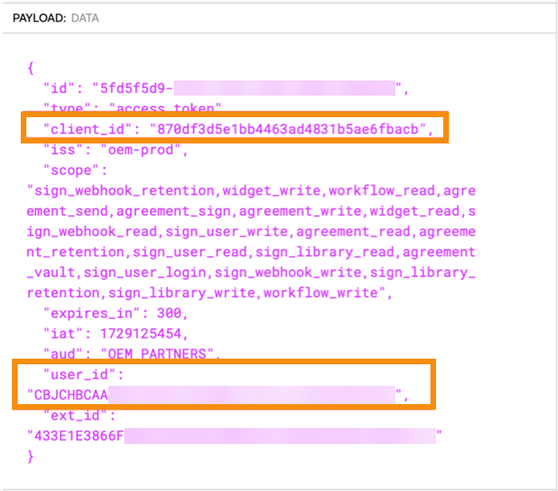

# Implementation Notes and Best Practice

Last update: Oct 30, 2025.

<InlineAlert slots="header, text" />
Tip

Your feedback is valuable and is vital in improving our product and documentation. Send suggestions to acrobatsignembed@adobe.com.

This page identifies the major change areas, deprecated features, new features, and learnings from our conversations with Embed Partners.

## Changes

No Acrobat Sign asset IDs are changing as part of this process, and they are not being relocated. The major changes are:

- **Access token handling** – OAuth consent flows are eliminated, as are onboarding emails and the ability to authenticate Acrobat Sign users with an Acrobat Sign username and password. The refresh token is deprecated. (see more on Access Token Handling, below)
- **Provisioning endpoints for accounts and users** – The URLs for these endpoints change a bit and the payload has been enriched. These new provisioning endpoints include “v1” in the URL path.
- **Adobe Sign Web UI is no longer accessible for any migrated accounts** – Post-migration, Adobe Sign Account Console (aka Web UI) is no longer available for use, and all Acrobat Sign access occurs via the API. However, you can still access these pages via embedded views.
- **Migration tool** – The Embed 2.0 migration tool is robustly designed with fault-tolerance and rollback capabilities. You provide a spreadsheet mapping the old email addresses to the new, and our Migration Support team will upload them and monitor the job until successful completion.
- **Migration rollback** – You can rollback a migration. This will rollback all the users/accounts migrated. Rollback will undo the entire migration not a specific account/user. For example:
  - Say a migration had 20 users across three accounts, doing rollback for this migration will undo all 20 users across 3 accounts to previous state. 
  - Rollback can be initiated through migration-support-executive.
- **Migration Status API** – checks to see if an individual user has been migrated. See accompanying documentation at the end of this document.

## Embed 2.0 deprecates the following:

- **Onboarding emails** – Invitation-to-set-password and agree-to-terms-of-use emails.
- **OAuth consent flows** – Requirement for your customer-admin to navigate the OAuth consent flow to manually grant consent to your partner application to access their account.
- **x-api-user in REST header** – Within the V6 REST headers. You’ll need to remove this or it will throw an error.
- **POST [/oauth/v2/refresh](https://secure.na1.echosign.com/public/static/oauthDoc.jsp#refreshRequest)** – Embed user tokens are not refreshed but must be replaced at the end of the five-minute lifespan.

## Embed 2.0 adds the following:

- [Embed 2.0 Authentication and Provisioning APIs](embedapi2.md)
- [POST /v1/accounts](https://opensource.adobe.com/acrobat-sign/embedpartner/embedapi2.html#id7) (and PUT /V1/accounts) enables you to configure three “consumables”: SEATS, KBA, PHONE_AUTH:
  - **SEATS**: This consumable represents the number of user seats available in an account. Each seat allows one user to access and use the services provided by the account. For example, if an account has a cap of 10 SEATS, it means up to 10 users can be assigned to use the account’s services at any given time. Recommendation: Set the SEATS “cap” to “0” or “-1” for an unlimited number of seats.
  - [PHONE_AUTH](https://helpx.adobe.com/sign/config/send-settings/auth-methods/phone-auth.html): This consumable is related to phone authentication, a method used to verify a user’s identity. It involves sending a verification code to the user’s phone via SMS or voice call, which the user must enter to access the service. Each PHONE_AUTH transaction is consumed per recipient, meaning if an agreement requires phone authentication for three recipients, it will consume three PHONE_AUTH transactions. Recommendation: Set PHONE_AUTH “cap” to “0” for unlimited or “-1” to disable.
  - [KBA (Knowledge-Based Authentication)](https://helpx.adobe.com/sign/config/send-settings/auth-methods/knowledge-based-auth.html): This is a premium authentication method that verifies a user’s identity by asking them to answer personal questions based on public records. Each KBA transaction is consumed per recipient (like PHONE_AUTH). For instance, if an agreement requires KBA for three recipients, it will consume three KBA transactions. KBA is typically used in scenarios requiring a high level of identity verification. Recommendation: Set KBA “cap” to “0” for unlimited or “-1” to disable.
- [POST /v1/users](https://opensource.adobe.com/acrobat-sign/embedpartner/embedapi2.html#post-user) – the email addresses in the request must be sixty characters or less including the “@domain.com.”” Create an admin user by assigning one or both roles: ACCOUNT_ADMIN, PRIVACY_ADMIN

```{
  "firstName": "Adrian",
  "lastName": "Administrator",
  "email": "123456789o123456789o123456789o123456789@oemtest2.com",
  "emailAlias": "drian_A@joesBikes.com",
  "accountId":"{{accountId}}",
  "roles": [
  "ACCOUNT_ADMIN",
  "PRIVACY_ADMIN"
  ]
  }
```

- GET /v1/accounts – Returns Acrobat Sign accounts created using your technical account token.
- POST /v1/users/migrationStatus – The [private API to get the migration status of a user](migration_faq.html#private-api-to-get-the-migration-status-of-a-user) is documented at the bottom of this page.

## Access token storage and validation

Embed 2.0 replaces OAuth with the following elements:

- **clientId** – is available via copy/paste from your Adobe Developer Console.
- **clientSecret** – is available via copy/paste from your Adobe Developer Console.
- **technical account token** – 
  - Is available via copy/paste from your Adobe Developer Console
  - Via cURL – The developer console provides a cURL that you can import into Postman to quickly create the first call you will use to create a technical account token.
  - The technical account token expires in 24 hours.
  - Validated ‘offline’ using the logic described below.
  - Validated using the /v1/validate_token endpoint.
- **JWT encoding the user email** – The JWT base64 encodes the user email. In combination with the above, is exchanged for the embed user token used to make Acrobat Sign REST v6 calls.
- **Embed-user token – is used to make Acrobat Sign REST v6 API calls in place of OAuth tokens.**
  - The embed-user token expires in 300 seconds (5 minutes). 
  - Validated ‘offline’ using the logic described below. 
  - Validated using the /v1/validate_token endpoint.
- **Operation replacing /v2/refresh** – Before any call to an Acrobat Sign REST v6 endpoint such as GET/agreements, validate the embed-user token using one of the following methods and if the token has expired or is about to, create a new embed user token 
  - Offline check – The response from POST/v1/token includes **“expires_in”: 300.** Add this to the **iat** timestamp of the token to determine if the token remains valid:



  - Note also that client_id of your Embed 2 app as well as the user_id of the token owner, are displayed when this JWT is decoded. 
  - [/v1/validate_token](embedapi2.md#validate-embed-user-token) – A valid token will return something like this:

```{
"valid": true,
"expires_at": 1727732199
}
```

## Pre-migration planning

**Choosing a domain** – Before you can, “claim a domain,” as described in the onboarding instructions, your organization must decide on the domain you want to use and work with your internal teams to set it up.

- Adobe recommends using a subdomain like: “esign.partner.com.”
- Consider setting up domains or subdomains for test environments. For example: esignTest.partner.com, esignQA.partner.com, etc.
- Any domains you plan to use must be “validated” within the Adobe Admin Console. This requires the involvement of someone from your team that can access the DNS console for these domains.
- If the Admin Console tells you that your desired domain has “already been claimed,” it means that another team at your company has already claimed that domain on behalf of other Adobe products. If this is your situation, you will need to resolve this internally or choose a different domain or subdomain.

**UsersToMigrate.csv** — You’ll provide a CSV file that maps your current customer-account email addresses to new email addresses within the claimed domain. If you need assistance identifying the account-admin emails that will be the subject of the migration, we can request a database query on your behalf. This requires some lead time. The CSV looks like this:

| email                        | newEmail                       | emailAlias                   |
|------------------------------|--------------------------------|------------------------------|
| joesRentals@propcompany1.com | joesRentals@esign.partner.com  | joesRentals@propcompany1.com |
| johnRentals@propcompany2.com | johnsRentals@esign.partner.com | johnRentals@propcompany2.com |

- The maximum number of users in the csv should be no more than 5000.
- The maximum file size of the user csv should be no more than 1 MB.
- 5000 users will take about 1.75 hours to process.
- You can migrate one account at a time, migrating smaller account first to gain confidence in the process.
- [Download a sample CSV](https://static.echocdn.com/enterprisemigration/docs/sample-f2c56f2e6167836b105247e06e38f423.csv).
It is preferable to do the migration during a maintenance widow so new Acrobat Sign transactions are not created during the migration. The maintenance window should be long enough to perform your post migration tests and any rollback should one be required.

## Testing Migrations

**Setting up test-migrations** – You will test migrations, by creating Acrobat Sign accounts on the PRODUCTION environment using your existing process, but with test-users.

- Create test-users with functioning email accounts to respond to password-set and terms-of-use onboarding emails.
- Email inboxes are not required if you are provisioning new accounts via SOAP.
- Gmail addresses are not supported but the following email conventions are: (EXAMPLE?)
- The PSM team can also assist in creating these Acrobat Sign test accounts. 

After migration, these accounts will not be able to access the Acrobat Sign Web UI:

- joesbike@propcompany1.com
- johnsbike@propcompany2.com

These accounts will only be able to access Acrobat Sign assets via API, via your Certified App, or using an integration key which you can create from the ACCOUNT_SETTINGS view (POST/v6/users/ID/views):

- joesBikes@esign.partner.com
- johnsBikes@esign.partner.com

**DO NOT USE THE ADMIN CONSOLE to add Acrobat Sign users to your accounts. Add Acrobat Sign administrators and users to your accounts via API only!** There is no way to associate a user added via the Admin Console to an Acrobat Sign account. Add users to your new accounts VIA API ONLY!

**Identify test cases** – Which use cases do you plan to test? If your document flow sends all agreements through a service account (such as the admin account), set up a new account that mirrors this. Include webhooks if any. Create tests that simulate your most complex signing flows. For example, some users will sign before migration and plan for others to complete the signing after migration. The goal is to ensure that in-flight agreements look and behave as expected post-migration and that your application is responding correctly to any webhook posts initiated by your new clientId. For a time, your app will be receiving webhook posts from two clientIds. Be sure to include the new clientId in your allow-list, if you use one. Use your existing certified partner app to create new accounts and in-flight Acrobat Sign transactions that you will complete and introspect after the test migration is completed. Note that you can test a migration without a certified app, using Postman or Swagger to introspect your assets post migration. Embed-user tokens work with our Swagger page. Use the embed user token for authentication. Be sure to prepend “Bearer” to the token.

## Testing Environments

Your test migration will take place in the Acrobat Sign Production environment. Your Sandbox environment is not involved in testing the migration itself. These guidelines will help you configure multiple pre-production environments on Sandbox should you have the need to do so. THIS IS NOT A REQUIREMENT.

**Set up one technical account to use in sandbox, and different one to use in prod.** Even though the technical account token created for your Embed 2.0 Sandbox can operate across all environments, you should (at a minimum) use one token for Sandbox and another for Production. If required, you could also set up different technical accounts for each environment (e.g. different ones for: Development, Test, QA, Production).

**How do I set up my Development, Test, QA and Production environments using the Acrobat Sign Sandbox and Production environments that Adobe provides?** For each environment, create a childOrg in the Admin console and map it to claimed domain or subdomain as follows:

In Sandbox:

- dev.partner.com is linked to child_org_dev
- stage.partner.com is linked to child_org_stage
- preprod.partner.com is linked to child_org_preprod
In Production:

- esign.partner.com is linked to child_org_prod


## Migration Status of a User

|                              | **Value**                                                                                       |
|------------------------------|-------------------------------------------------------------------------------------------------|
| HTTP Method                  | Post                                                                                            |
| Endpoint Operation           | /v1/users/migrationStatus                                                                       |
| Authentication/Authorization | Valid Technical Account Token \<br/\> Mandatory Scopes in token - **sign_user_read**            |
| Audience                     | Partner will call this API to check the state of a user whether it is migrated or not.          |
| Request Header               | [Partner Migration Status APIs Headers](migrationfaq.md#partner-migration-status-apis-headers) |
| Response Object              | [MigrationStatusReponse](migrationfaq.md#migrationstatusreponse)                               |
| HTTP Status Code             | 200                                                                                             |
| Error Code                   | [Error Response - User Migration Status](migrationfaq.md#error-response-user-migration-status) |

## Request Form parameters

| **Parameter Name** | **Type** | **Description**                  | **Optional/Required**                                                              |
|--------------------|----------|----------------------------------|------------------------------------------------------------------------------------|
| email              | String   | email Id of the user             | Either a UserId or Email is required.                                              |
| userId             | String   | Acrobat Sign User Id of the user | Either UserId or Email is required. User Id will get priority if both are present. |

## Response Object

**Migration status Response**

| **Parameter Name** | **Type** | **Description**                                                                                                                                                                                                                                                                           | **Value Range**                                              |
|--------------------|----------|-------------------------------------------------------------------------------------------------------------------------------------------------------------------------------------------------------------------------------------------------------------------------------------------|--------------------------------------------------------------|
| state              | Enum     | Check if the user is migrated to Embed 2.0 on not.\<br/\> -MIGRATED - The User has been Migrated Successfully\<br/\> -NOT_MIGRATED - The User is not migrated and can continue to access Sign using the legacy Embed model.                                                               | MIGRATED/NOT_MIGRATED                                        |
| migrationStatus    | Enum     | Status of a user with respect to migration and identify the correct model of the user.\<br/\> - MIGRATION_REQUIRED - Migration not started for this user.\<br/\> - IN_PROGRESS - Migration is in progress.\<br/\> - SUCCEEDED - Migration successful.\<br/\> - FAILED - Migration Failed. | If the User State is MIGRATED, the Migration Status will be: |

SUCCEEDED
If the User State is NOT_MIGRATED, the Migration Status can be:
MIGRATION_REQUIRED
IN_PROGRESS
FAILED
|

**Sample Response**
```
{
"state": "MIGRATED/ NOT_MIGRATED"
"migrationStatus": "IN_PROGRESS/SUCCEEDED/FAILED/MIGRATION_REQUIRED"
}
```

## Error Response

**Error codes**

| **HTTP Status Code** | **ErrorCode**          | **Message**                                                            |
|----------------------|------------------------|------------------------------------------------------------------------|
| 400                  | BAD_REQUEST            | The request provided is invalid.                                       |
| 400                  | INVALID_PARAMETER      | The `<param_name>` value specified is invalid.                         |
| 400                  | MISSING_REQUIRED_PARAM | Required parameter `<param name>` is missing.                          |
| 401                  | INVALID_TOKEN          | Token provided is invalid or expired.                                  |
| 403                  | AUTHENTICATION_FAILED  | Partner is not onboarded successfully.                                 |
| 403                  | MISSING_SCOPES         | The token does not contain the required scopes.                        |
| 403                  | PERMISSION_DENIED      | The API caller does not have the permission to execute this operation. |
| 404                  | USER_NOT_FOUND         | User not found.                                                        |
| 500                  | MISC_SERVER_ERROR      | Some miscellaneous error has occurred.                                 |

## Partner Migration Status APIs Headers

| **Header Name** | **Values**                        | **Description**                                           |
|-----------------|-----------------------------------|-----------------------------------------------------------|
| Authorization   | Bearer `<Technical Account Token>`  | Technical account token that is generated by the partner. |
| content-type    | application/x-www-form-urlencoded | Media type of the resource.                               |
| x-request-id    | String                            | A string value needed to track a given request            |

<HorizontalLine />
© Copyright 2022, Adobe Inc..  Last update: Jan 30, 2025.

