# Embed Partner Onboarding v 2.0

<InlineAlert slots="text" />

Your feedback is valuable and is vital in improving our product and documentation. Send suggestions to [acrobatsignembed@adobe.com](mailto:acrobatsignembed%40adobe.com).

## Overview

To smoothly integrate and onboard to Acrobat Sign, partners must complete a one-time setup.

The [Adobe Acrobat Sign Sandbox](https://helpx.adobe.com/sign/developer/sandbox/overview.html) is an enterprise offering to test Acrobat Sign workflows, integrations, and APIs in a risk-free environment before pushing to production. This allows you to practice and confirm your ability to create accounts in Acrobat Sign, add users to these accounts, and utilize Sign through the REST v6 APIs.

For non-embed customers, Acrobat Sign includes the following two offerings:

- For Sandbox environment: Adobe Acrobat Sign Sandbox
- For Production environment: Acrobat Sign Solutions for enterprise

For the Embed 2.0 customers, Acrobat Sign now includes Acrobat Sign Embed - TRNS, a unique product offering that provides services for both Production and Sandbox.

Admins can access the Sandbox environment using the "Acrobat Sign Embed - TRNS” offering. This Embed 2.0-specific offering has Sandbox bundled with it and automatically creates a Sandbox environment when a new contract is created between Adobe and the Partner. Once you create the Partner organization with the “Acrobat Sign Embed - TRNS” offering, the admins already have access to onboard to the Acrobat Sign Sandbox environment.

With this new offering, the following UI interfaces remain the same for both Sandbox and Production environments:

- Admin console: [https://adminconsole.adobe.com/](https://adminconsole.adobe.com/)
- Global admin console: [https://global-admin-console.adobe.com/](https://global-admin-console.adobe.com/)
- Developer console: [https://developer.adobe.com/console/home](https://developer.adobe.com/console/home)

Since the user interfaces (UIs) are identical for both sandbox and production environments, much of the onboarding process completed for the sandbox doesn’t need to be redone when onboarding to production.

When onboarding to production, partners must call the baseURI API and then re-implement only the following steps:

- [Register the partner on Acrobat Sign](onboarding2.md#register-the-partner-on-acrobat-sign)

It creates a new entry for Acrobat Sign. Register Partner API calls are made to the Sandbox environment while in the testing phase and thus need to be repeated in case of onboarding to production.

- [Onboard your customers](onboarding2.md#onboard-your-customers)

You must associate the partner with a new embed channel and re-certify the Partner App on the new environment.

## Set up Parent organization

### Create Parent organization

Adobe initiates the organization setup process as follows:

1. You provide the name and email address of up to two administrators to your Product Success Manager.
2. Adobe creates your organization within the Admin Console, adds your admin contact information, and assigns global and system admin roles.

When the process completes, your admin(s) receive 2 invitation emails: one each for the Admin and Global Consoles. If you don’t receive the emails you can access the admin consoles directly using the following URL’s:

- [https://adminconsole.adobe.com/](https://adminconsole.adobe.com/)

- [https://global-admin-console.adobe.com/](https://global-admin-console.adobe.com/)

<InlineAlert slots="text" />

You can login to complete the setup once the Adobe team has setup your account.

### Accept invite and access Adobe Admin Console

After Adobe creates your organization, the admin(s) must create an account with Adobe:

1. Admin user receives two emails.

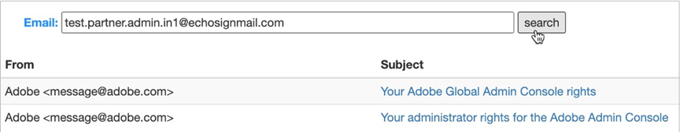

2. Open the invitation with subject “You administrator rights for Adobe Admin Console” and then select **Get started**.

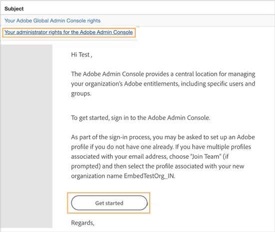

3. Verify your identity.

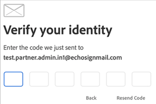

4. Complete the account creation by setting up your admin account.

### Claim domain

The admin must claim a domain and link it with a **federated** directory. It allows you to create users with the claimed domain and add them in Embed accounts.

1. **After you complete the account setup steps above, you land on the Admin Console page, as shown below.**
Alternatively, you can log in to the [https://adminconsole.adobe.com](https://adminconsole.adobe.com) with the credential you created above.

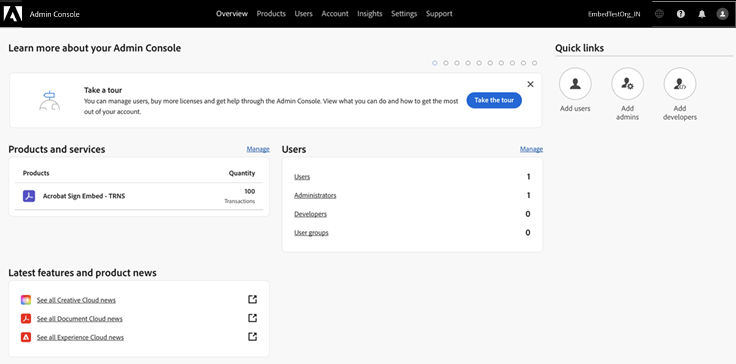

2. Go to **Settings > Identity Settings > Domains**.
3. Select **Add Domain**.

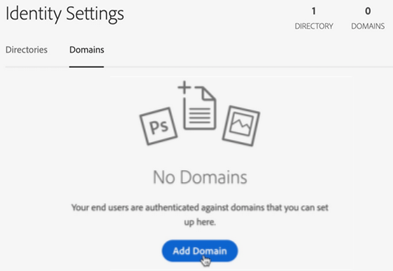

4. Specify a domain.

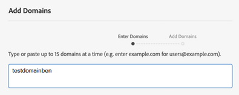

5. Select **Next**.
6. Select **Add Domains**.
7. Select **Validate**.

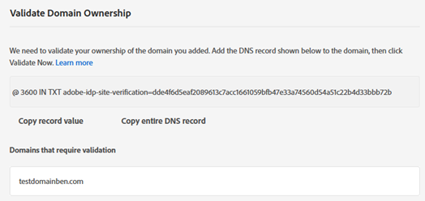

8. **Copy the key string**.
Example key string: @ 3600 IN TXT adobe-idp-site-verification=dde4f6d5eaf2089613c7acc16610593a74560d54a51c22b4d33bbb72

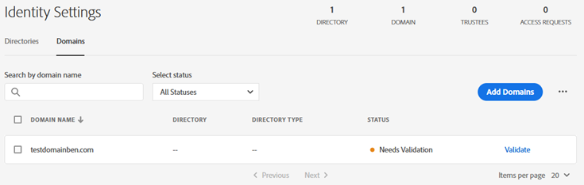

9. Validate your domain.

[Learn how to validate your domain.](https://helpx.adobe.com/enterprise/using/add-domains-directories.html#validate)

<InlineAlert slots="text" />

It might take a while for the DNS change to fully go through, potentially up to an hour, before Adobe can confirm the ownership of the domain. If you get an error after adding the DNS settings, please wait and try again later. The web might not have updated the DNS settings yet.

10. After the domain claiming process completes, select **Validate now**.

### Create a Directory and link with the claimed domain

1. If you are in a new session, you must re-login to the Admin Console.

  [Go to Admin Console](https://adminconsole.adobe.com/).

2. Go to **Settings > Identity Settings > Directories**.
3. Choose **Create Directory**.

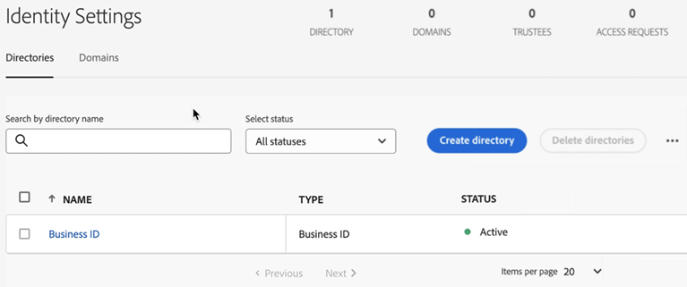

4. Enter a directory name.

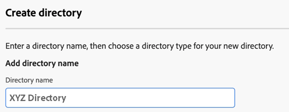

5. Select the Directory type as Federated ID

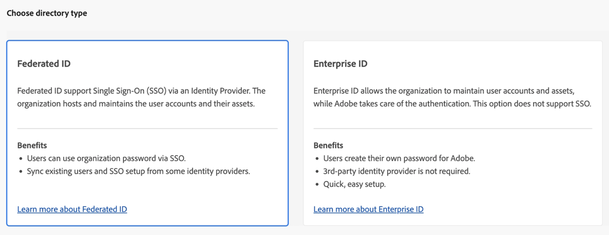

6. Select **Next**.
7. As IDP setup is not required, select **Cancel** from the following screen. When you see the “Auto-account creation will be enabled” dialog, select **Confirm**.

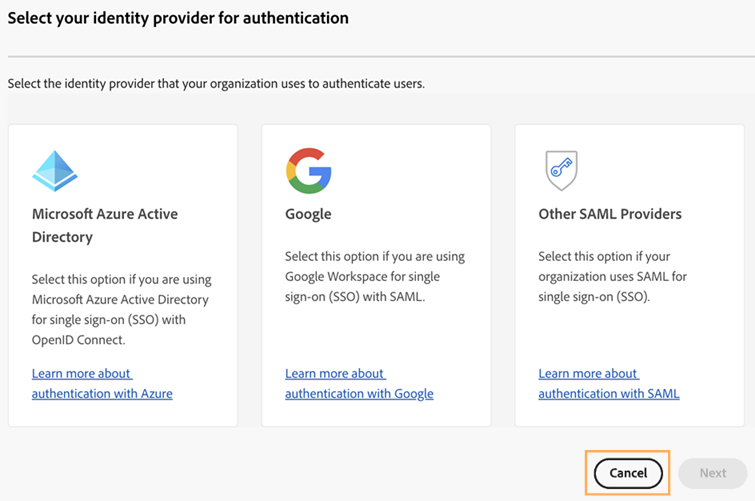

8. Go to the Domains tab and then for your claimed domain, select **Link Directory**.
9. On the ‘Link a Domain and a Directory’ page, from the dropdown menu, select the directory created above and then select **Link**.

## Create and configure Child organization

### Create a Child organization

You can use the Global Admin Console to establish your organization hierarchy, assign products to your organizations, and review or submit changes. The child organization resides beneath the parent organization hierarchy. The child org is where you will [Create a technical account](onboarding2.md#create-a-technical-account) and all the users for your customers. This hierarchy keeps your customer accounts and users separate from your company’s users.

1. Select the Global Admin Console icon on the Admin Console or go to [https://global-admin-console.adobe.com/](https://global-admin-console.adobe.com/) and log in with your admin credentials.

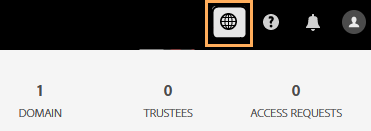

2. On the global admin console page that opens, select the parent organization if it isn’t selected by default. Then, select **Policies**.

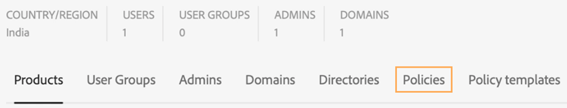

3. From under the Policies tab, enable the **Inherit system admins from parent when child organization is created** option.

Allowing this setting before creating the child org will automatically add the administrators of the parent org as administrators of the child org when the child org is created. Administrators will not be inherited from the parent org for any child org created before this setting is allowed.

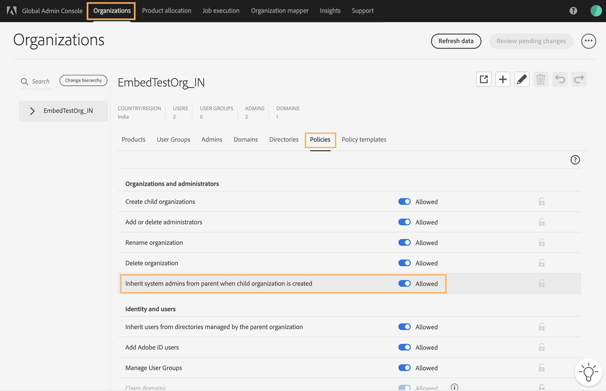

4. From the upper-right corner, select **Review pending changes**. Wait for the Job Completed Status.
5. From upper-right corner of the Job Execution and History page, select **Submit changes**.
6. Select the Organizations tab and then select the plus icon to create a child organization.

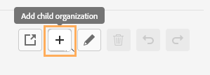

7. Enter a child organization name, specify a country or region, and then select **Save**.

The selected Country/Region determines the region for which the technical account is provisioned on Acrobat Sign.

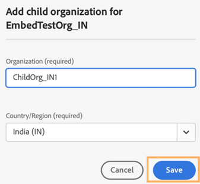

8. Select **Review pending changes** and then select **Submit changes** to apply the changes.
9. Select **Organizations** tab and then review the Admins and Domains section of the Child Org to ensure that the administrators and domains have been inherited as expected.

### Allocate transactions to the Child organization

After creating the child organization, you must assign the Acrobat Sign Embed product to it. This step is essential for enabling the child org and the upcoming technical account to access Acrobat Sign Embed features, including Sign Embed and Acrobat Sign APIs. When assigning the product, make sure to allocate at least one transaction to the child org.

<InlineAlert slots="text" />

The allocation count assigned to the child organization doesn’t limit the number of transactions permitted for the users within this organization.

1. From the top bar, select **Product allocation**.
2. From the drop-down menu, select **Acrobat Sign Embed - TRNS** and then select the **Sign Transactions (transactions**) tab.
3. From under the ‘Grant’ column, select the plus icon for the child organization you just created.

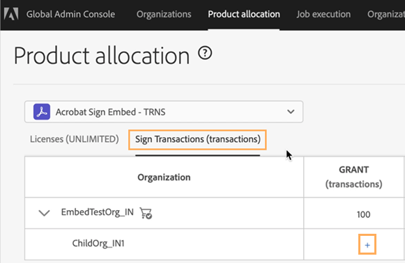

4. Allocate at least 1 transaction of the Acrobat Sign Embed product and then select **Save**.

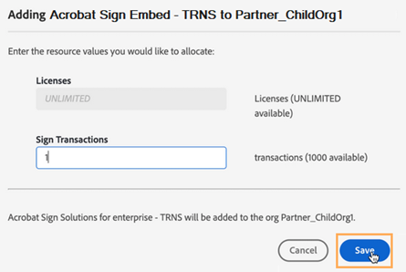

5. From the upper-right corner, select **Review pending changes** and then select **Submit changes**.
6. Select **Organizations** tab and review that Products have been allocated to the Child Org.

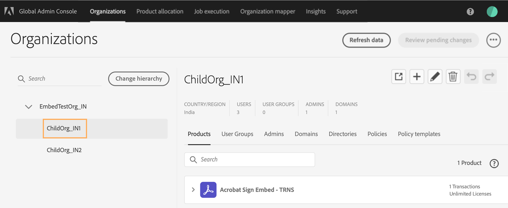

7. Verify your configuration as follows:

  1. Admin user receives a welcome email with subject “Your administrator rights for the Adobe Admin Console for the [your] Child Org”.

  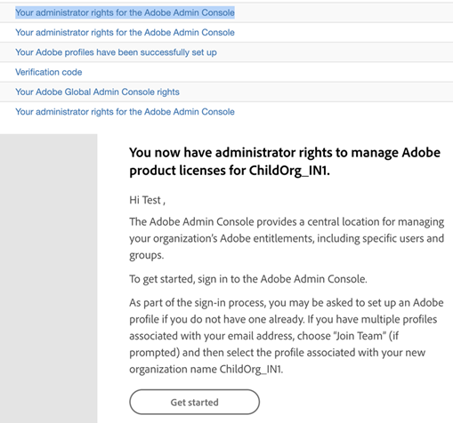

  2. Select **Get Started**.
  3. On the dialog that opens, enter the password and then select **Continue**.

  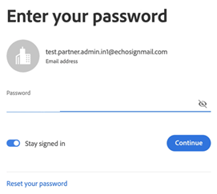

  4. Select **Join team**.

  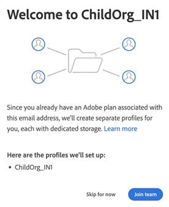

  5. Select the Child Org profile to sign in.

  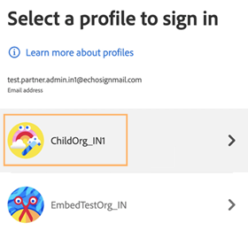

  6. On the admin console with child Org profile, validate the profile and also the product and transactions allocated.

  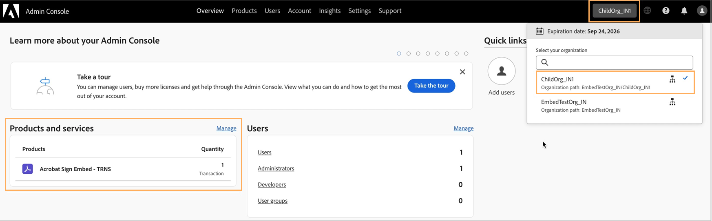

## Create a technical account

As part of the Partner onboarding process, a Technical Account (developer console account) must be created. This specialized service account is essential for generating the technical account token, which serves as the Partner’s authentication credential for engaging with Acrobat Sign. The technical account token is utilized to initiate customer provisioning APIs at both the account and user levels, as well as to generate tokens for customer users.

<InlineAlert slots="text" />

The following steps require system admin privileges. The child organization may have users with developer role, but only admin users have access to add the requisite API SDKs.

1. After you log into the admin console with the Child Org profile, select the **Products** tab.

2. From next to the ‘Acrobat Sign Embed - TRNS’ listing, open the 3-dot icon menu and then select **Go to Developer Console**.

It redirects you to profile selection page of the developer console.

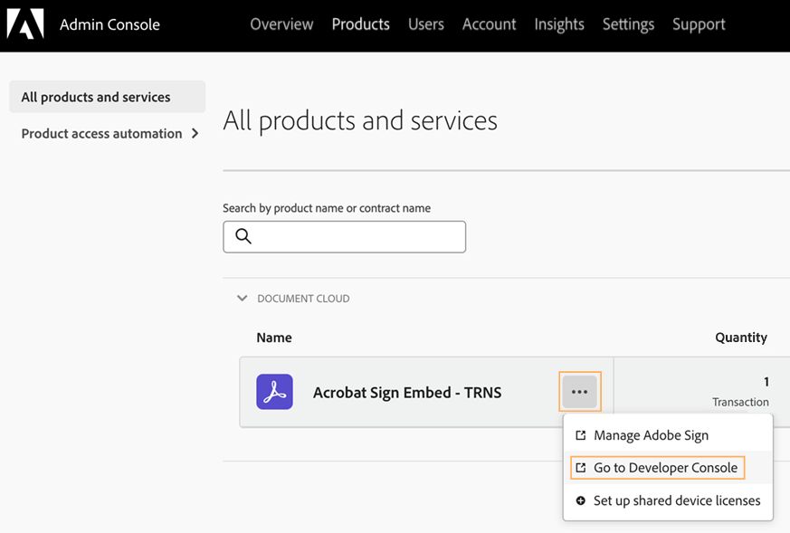

3. Select the child Org profile you created above. It prompts you to accept the Adobe Developer Terms of Use.
4. On the Developer console home page that opens, select **Create New Project**.

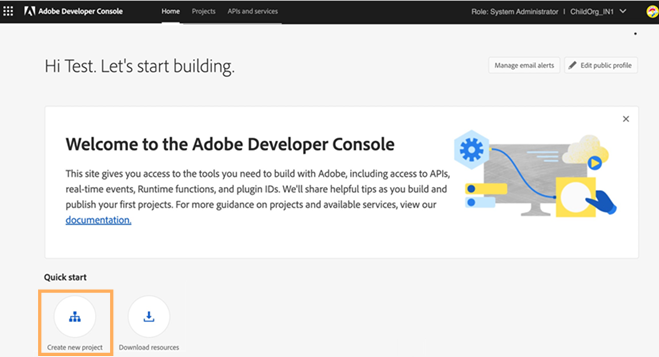

5. Select **Add API**.

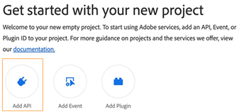

6. **Select Acrobat Sign Embed API SDK**

It provides the partner with privileges to call the Sign Embed service APIs, create Acrobat Sign accounts, and add users.

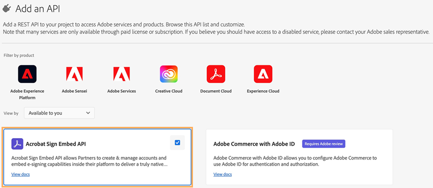

7. Select **Next**.
8. Select **OAuth Server-to-Server** and select **Next**.

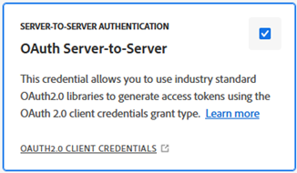

9. Select Product profiles and select **Save Configured API**.
10. Verify that the Project contains the added SDK.

## Generate Technical Account Token via UI or via curl command

1. **From under the Credentials section in the left panel, select OAuth Server-to-Server.**
    From here, you can get all details of the technical account like client id, client secret, scope, and more.

2. Select **Generate access token** to create Technical Account token. A screen appears with the requisite developer details, as shown below.

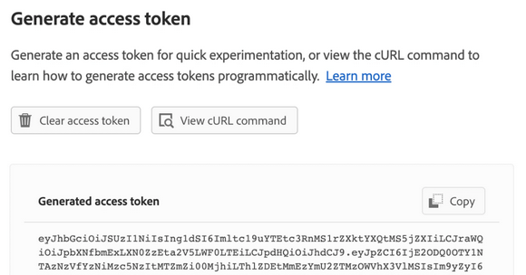

<InlineAlert slots="text" />

The technical account token generated has a default validity of 24 hours. You can also use the curl command to generate the token. To get the curl request, select **View cURL command**.

## Register the partner on Acrobat Sign

### Call the Sign GET BaseUris API

[Call the Sign GET BaseUris API](embedapi2.md#base-endpoint-api) using the Technical Account token. Partners are required to use the value of the “apiAccessPoint” obtained from the API response as the base URL for all API calls.

### Call the register Partner API

You can now use your technical account token to register with Acrobat Sign via the [register partner API](embedapi2.md#register-apis). You must use the Register API to register your application in both production and sandbox.

### Provide account info to Adobe

Once the above steps are complete, provide the “Partner ID” to your Product Success Manager to complete the rest of the configurations.

Your Product Success Manager will establish a Channel and incorporate your technical account into it. If you have sandbox access, they will assist in activating your application in the sandbox environment, enabling you to utilize Sign Embed services there. However, note that full access to the Acrobat Sign Embed services in the production environment requires formal certification of your application by Adobe.

<InlineAlert slots="text" />

Before using Acrobat Sign Embed services in production, your application must undergo formal certification by Adobe. Once your development is complete, you collaborate with your Product Success Manager to get your application certified.

## Onboard your customers

Once your Partner Application is certified, you can use the [Acrobat Sign Embed APIs](embedapi2.md) to create customer accounts, add users, and generate user tokens.
