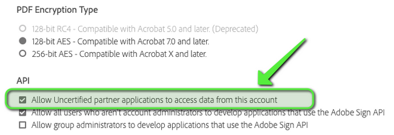

# Certifying Your Partner App v.1.0

<InlineAlert slots="text" />

Your feedback is valuable and is vital in improving our product and documentation. Send suggestions to [acrobatsignembed@adobe.com](mailto:acrobatsignembed@adobe.com).

Certification is an essential step in the partner app deployment process. It is required for applications that must access multiple Acrobat Sign accounts and provides several benefits:

+ Enhances the app’s security through an extensive security review.
+ Assures the security of customer data and workflows.
+ Avoids using an app or integration with security settings that allow “uncertified app data access”.

<InlineAlert slots="text" />

When your app is ready, [you can certify it](https://adobe.na1.documents.adobe.com/public/esignWidget?wid=CBFCIBAA3AAABLblqZhC6C5oHcS7JEZRkhhFwlvbQ9BEo2-MNiYCNvGtJqdBnD-BkDf8YeeykaXrJ9mePk38*#://).

## Certification best practices

While certification is a simple process, there are some recommended best practices:

+ Testing: You can still test your app prior to certification. To use other accounts representing that simulate a customer’s account, go to the web app’s **Account > Account Settings > Security Settings** and check “Allow Uncertified partner applications to access data from this account”.

    

+ Configure your platform: You need to allow admins and/or users to connect their Acrobat Sign accounts via [oAuth](https://secure.echosign.com/public/static/oauthDoc.jsp). Either you have provisioned these accounts or they have done it themselves.

+ Security:
  + Follow the [OWASP top 10 security techniques](https://www.owasp.org/index.php/Category:OWASP_Top_Ten_Project)
  + Encrypt all tokens and your app secret.
  + Speed up the process by providing any recent 3rd party security testing summary reports you may already have, related to the OWASP guidelines.

+ Timing: Be finished or nearly finished with your integration development so Adobe reviewers can log into an instance to do their testing.

## Security review

During the security review and certification process, the Acrobat Sign Security team does the following:

+ Reviews the process of connecting your application/platform to Adobe Sign as well as the typical use of the related functions. A meeting with you may include the partner manager from Adobe, someone from the security group, and your Solution Consultant. In this meeting, Adobe reviews the oAuth process from your app plus basic instructions on sending, tracking and/or signing for your app’s typical eSign use case. The meeting is normally recorded so security can refer back during testing.

+ Reviews the instructions and implementation for connecting an instance of your app/platform to Adobe Sign, Send and Track or other functions you’ve implemented to verify the integration is not exposing our mutual customers to any major security or data breach vulnerabilities.

+ Verifies your store all tokens for the integration in an encrypted format.

If there are any major issues, the team provides details. Once all concerns have been addressed, your app is certified and you will be able to make it available to your customers for general use. If your integration functionality or app permissions need to change, the application must be re-certified.

## Post “certification”

Once your integration is certified, you can work with our Partner Success Managers to collaborate on co-marketing. We can also list your integration on the Adobe Exchange - Document Cloud page. As a best practice, provide Adobe with marketing collateral and documentation links so that users can find details on our partner website about how the integration works, the range of functionality included, and so on.
