# Acrobat Sign Developer

Last update: Apr 30, 2023.

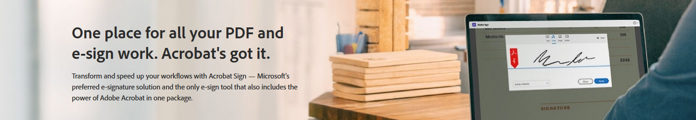

## Getting Started

|               |               |               |
| ------------- | ------------- | ------------- |
| [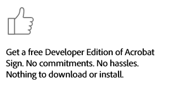Dev Account Form](https://www.adobe.com/go/acrobatsigndevedition) | [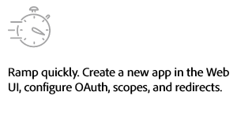Application Quickstart](./developer_guide) | [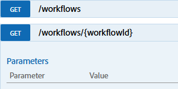REST API Reference](https://secure.na1.adobesign.com/public/docs/restapi/v6) |
| [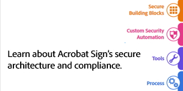Security and Compliance](https://www.adobe.com/trust/resources.html)| [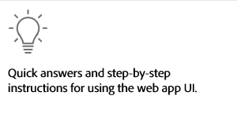Web App: End User Help](https://helpx.adobe.com/support/sign.html) | |

## Developer Guides

|               |               |               |
| ------------- | ------------- | ------------- |
| [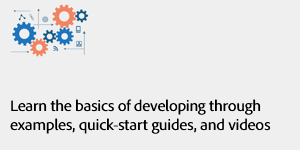Developer Guide](./developer_guide) | [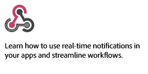Webhook and Event Reference](./acrobat_sign_events/index.md) | [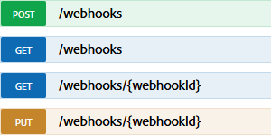REST API Reference](https://secure.na1.adobesign.com/public/docs/restapi/v6) |

## Postman

|               |               |               |
| ------------- | ------------- | ------------- |
| [Acrobat Sign Postman Collections](https://www.postman.com/adobe/workspace/adobe-acrobat-sign/overview) | [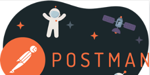Postman Overview](./developer_guide) | [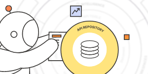Getting Started with Postman](./developer_guide) |
| [How to use Postman](https://learning.postman.com/docs/getting-started/introduction/) | | |

## SDKs

|               |               |               |
| ------------- | ------------- | ------------- |
| [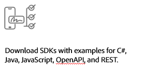SDK Downloads and Docs](./sdks) | [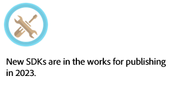Coming Soon!] | [Developer Guide](./developer_guide) |

## Sign for Government

|               |               |               |
| ------------- | ------------- | ------------- |
| [Quickstart](./signgov/gstarted.md) | [Developer Guide](./developer_guide) | [Acrobat Sign Security Overview](https://www.adobe.com/content/dam/cc/en/security/pdfs/AdobeSign_SecurityOverview.pdf) |
| [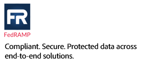FedRAMP Compliance](https://www.adobe.com/content/dam/cc/en/security/pdfs/AdobeSign_SecurityOverview.pdf) | | |

## Sign Embed

|               |               |               |
| ------------- | ------------- | ------------- |
| [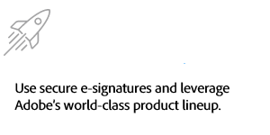Solution Brief](./embedpartner/solutionbrief.pdf) | [Quickstart](./embedpartner) | [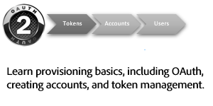Provisioning FAQ](./embedpartner/provisioningfaq.md) |
| [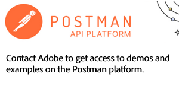Postman Examples](mailto:acrobatsignembed@adobe.com) | [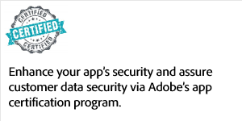App Certification](https://adobe.na1.documents.adobe.com/public/esignWidget?wid=CBFCIBAA3AAABLblqZhC6C5oHcS7JEZRkhhFwlvbQ9BEo2-MNiYCNvGtJqdBnD-BkDf8YeeykaXrJ9mePk38*) | [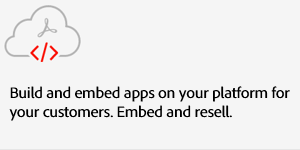Contact us](mailto:signembed@adobe.com) |
| [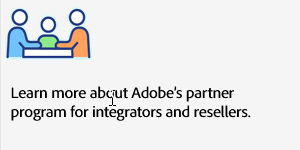Partner Program Sign-up](https://www.adobe.com/documentcloud/integrations/isv-partner-form.html) | | |

- - -

© Copyright 2022, Adobe Inc. Last update: April 30, 2023.

