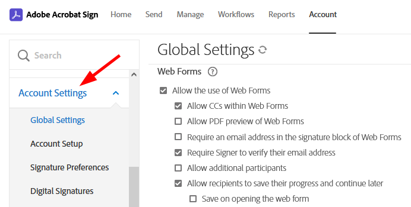

# Sign Gov and Commercial Comparison

The Acrobat Sign commercial and Sign Gov instances differ in some key ways as described below. 

Differences between Acrobat Sign Gov and Commercial

Item | Sign Gov | Commercial  
---|---|---  
Compliance | FedRAMP Moderate | PCI and HIPAA  
API application creation | By Adobe | Self-service: Account Admin’s can create API applications from Account page **Acrobat Sign API > API Applications**.  
Top-level domain | https://secure.na1.adobesign.us | https://secure.adobesign.com  
Authentication mechanisms | OAuth only | Commercial accounts can use the legacy API keys, integration keys, and OAuth.  
OAuth | Does not support x-api-user | Supports x-api-user  
OAuth APIs | Uses only the APIs described here. | Uses [commercial APIs](https://secure.na1.adobesign.com/public/static/oauthDoc.jsp)  
Impersonation | Exchange admin token for a user-specific token since x-api-user is unsupported. See [Impersonation](apps.html#impersonation). | Use an admin token with an x-api-user header to impersonate users by their userId or email.  
Login hint parameter | The login_hint query parameter is optional. | The login_hint query parameter is required.  
Endpoints | See below. | See below.  

## Impersonation setup

Unlike Acrobat Sign’s commercial instance, Sign Gov does
not support:

  * Fine grained (scope-level) impersonation.
  * Impersonating users by passing the user ID or email of the user in the x-api-user HTTP Header value as part of the REST API call.

Instead, in the Sign Gov environment:

>   * Impersonation applies to all the application scopes.
>   * x-api-user is unsupported, and impersonation involves generating OAuth
> tokens via the /authorize and /token endpoints.
>

The Sign Gov impersonation process is as follows:

  1. Generate an admin_token and associated admin_refresh_token.
  2. Use the admin_token to generate an impersonation_token.

Note the following:

  * Only account admins can generate an admin_token and each token can only be used to generate an impersonation token for users in the same account as the account admin.
  * The lifespan of the admin_token is 5 min.
  * The admin_refresh_token lifetime is unlimited, but will expire if inactive (not used) for more than 30 days.
  * You should persist the admin_refresh_token in a secure storage location (for headless partner integration).

<InlineAlert slots="header, text" />

Tip

Check out the [Sign Gov Postman collection](https://www.postman.com/adobe/workspace/adobe-acrobat-sign/folder/24728226-8eb1bfa8-4d5b-4099-b960-b55601d92103?ctx=documentation).

## Authentication endpoints

Note both the domain and version differences below.
Sign Commercial endpoints:

>   * GET https://secure.na1.adobesign.com/public/oauth/v2: Start the
> authorization code flow to login and consent to application permissions
>   * POST https://secure.na1.adobesign.com/oauth/v2/token: Obtain an
> access_token and refresh_token upon successful completion and redirect
> back from the authorization code flow
>   * POST https://secure.na1.adobesign.com/oauth/v2/refresh: Obtain a new
> access_token based on a refresh_token
>   * POST https://secure.na1.adobesign.com/oauth/v2/revoke: Revoke an
> access_token or refresh_token and any related tokens
>

Sign Gov endpoints:

  * POST https://secure.adobesign.us/api/gateway/adobesignauthservice/api/v1/token: Obtain an access_token and refresh_token upon successful completion and redirect back from the authorization code flow.
  * POST https://secure.adobesign.us/api/gateway/adobesignauthservice/api/v1/refresh: Obtain a new access_token based on a refresh_token.
  * POST https://secure.adobesign.us/api/gateway/adobesignauthservice/api/v1/revoke: Revoke an access_token or refresh_token and any related tokens.
  * POST https://secure.adobesign.us/api/gateway/adobesignauthservice/api/v1/logout: Log the web browser user out of identity provider if the subject matches that in the current identity provider session.

## Web app user interface

Sign Gov customers will see minor web application
differences between their view and the Commercial view. For example, not all
account settings apply in the Sign Gov environment, and these are removed from
the user interface. 
