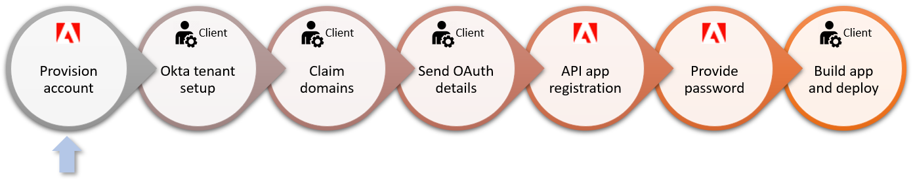
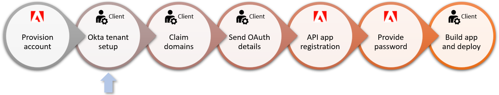
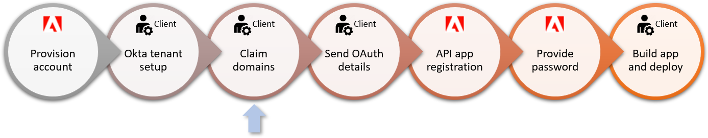
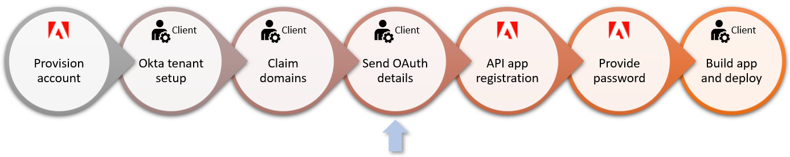
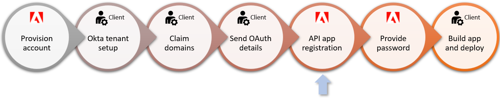
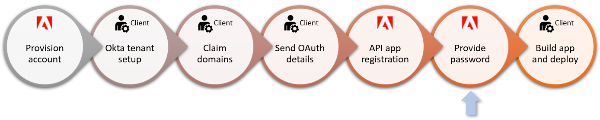
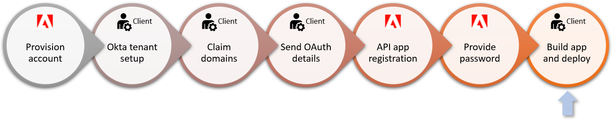

# Getting Started

New Solutions for Government customers should follow the process below to onboard with Acrobat Sign.

## Recommended first steps

While optional, Adobe recommends:

-  [Creating a backup admin manually.](https://helpx.adobe.com/sign/fedramp/okta/okta-add-user-manually.html)
-  [Reviewing the system requirements.](https://helpx.adobe.com/sign/system-requirements/sign-system-reqs-fedramp.html)

## Account provisioning

Adobe provisions your account once the formal setup process kicks off. You can simultaneously gather the required information and configure your systems as needed.

## Okta tenant setup

Okta provides the authentication mechanism for Acrobat Sign, and you must have an Okta credential before gaining product access. Adobe provides customers with a unique Okta instance, and there are two options for configuring user access:

-   **Use Okta directly as your identity provider.** This workflow requires each user to authenticate individually. It typically results in one less login screen.
-   **Integrate Okta with your organization’s existing identity provider and directory service.** You can use a SAML 2.0-compliant identity provider to manage user identities in bulk. This workflow allows users to only see the Okta login page a single time if they choose “Remember Me” during login.

After Adobe provisions the Okta account, the primary (tenant) administrator receives an email from Okta with a one-use activation link to the account’s Okta portal and the domain-claiming token needed to provision users on the Acrobat Sign system. Immediately do the following:

1. Use the one-time activation link to log in to the Okta system and set your password. It expires in 7 days.
2. Bookmark the Okta portal when you authenticate. Your Okta portal URL is unique to your account.
3. Record the DNS name, admin username, and admin password.
4. If you are using a directory service, [connect it now as described HERE.](https://helpx.adobe.com/sign/fedramp/okta/okta-add-federation.html)
5. Claim domains (below).

## Domain claiming

When you receive the domain claiming token as described in the previous step, claim your domains. Acrobat Sign prevents creating users with email addresses whose domains are not explicitly claimed by the account. The DNS domain could be a subdomain of your second-level domains; for example, adobesigngov.example.org if example.org is your domain.

Key actions:

-  Have access to any inboxes for email addresses on the DNS domain under your control. These are likely inboxes directly related to your DNS domain. Alternatively, you could use email forwarding; for example, [my.user@adobesigngov.example.org](mailto:my.user%40adobesigngov.example.org) could forward to [my.user@example.org](mailto:my.user%40example.org). You must be able to read invitation/activation emails for your users sent from your Okta instance to email addresses on your DNS domain.
-  For multi-tenant partner integration accounts, it’s recommended to also have a separate DNS domain for customer testing. This allows you to test customer account usage of a partner integration that’s defined on your partner account.

Add the token to DNS text records as follows:

1. Log in to your domain account.
2. Find the page for updating the DNS record. This page may be called DNS Management, Name Server Management, or Advanced Settings.
3. Find the TXT records for your domain.
4. Add a TXT record with the full token value supplied by Adobe. For example: `adobe-sign-verification=f9ccbThisIsNotARealNumber832`
5. Save your changes.

<InlineAlert slots="text" />

For more detail, see https://helpx.adobe.com/sign/fedramp/okta/okta-claim-domains.html.

## Provide OAuth details to Adobe

The Acrobat Sign team is responsible for enabling Solutions for Government API applications. The app registration process requires that you provide the following details:

-  Whether you need a customer (single-tenant) or partner (multi-tenant) API app.
-  A [redirect URL](https://git.corp.adobe.com/pages/dc/acrobat-sign-sdk/developer_guide/gstarted.html#configure-the-redirect-uri) which links the app instance to the correct Acrobat Sign account. 
-  A [list of required scopes](https://git.corp.adobe.com/pages/dc/acrobat-sign-sdk/developer_guide/gstarted.html#configure-scopes) that define what resources and actions are available to your app. 
-  An app name. 
-  Whether or not you require impersonation. Some clients provide a single impersonation token for all user actions while others prefer that users act on behalf of themselves. For example, a legal department may use a shared token while users in another organization will personally send and sign as individuals.

## Register the API application

The Acrobat Sign team registers the app based on your provided details. Once registered, you will receive an encrypted PDF with the `client_id` and `client_secret`.

## Password

A Professional Services team member calls with a password for the encrypted PDF.

## Deploy and build

Once this process is complete, you’re ready to build and deploy applications and signature workflows.

For more information, refer to these resources:

-  [REST API Reference](https://www.adobe.com/go/acrobatsignapireference)
-  [Developer Guide](https://www.adobe.com/go/acrobatsigndeveloper)
-  [Webhook Reference](https://www.adobe.com/go/acrobatsignwebhook)
-  [Postman collections](https://www.adobe.com/go/acrobatsignpostman)