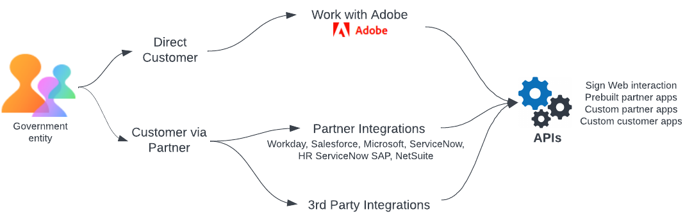
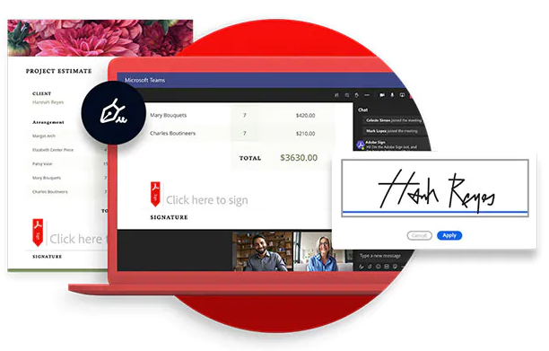

title: Sign for Government- Developer Overview

# Sign for Government: Developer Overview

The Acrobat Sign for Government (Sign Gov) is an Acrobat Sign instance engineered for FedRAMP Moderate compliance. Tailored for feature-rich and secure signature workflows, it has significant changes from commercial environments available to the non-government public. Adobe recommends that administrators and developers using this environment read this documentation even if familiar with previous Acrobat Sign trials or production accounts.

This guide provides details for those developing applications with the Acrobat Sign for Government APIs. Possibilities include:

* Leveraging Sign Web: Apps work out-of-the-box for customers with an Okta or Acrobat Sign for Government account.
* Using Pre-built partner API Applications for Sign APIs such as Microsoft 365 and Teams. Additional apps are coming in 2023, including those for ServiceNow, Workday, and Salesforce. These apps also work out-of-the-box for customers with an Okta or Acrobat Sign account.
* Custom customer API application using Acrobat Sign APIs: Requires Adobe to register the custom API application on the customer’s behalf.
* Custom partner API applications for Sign APIs: Requires Adobe to register the custom API application on the partner’s behalf.

Note that provisioning an Acrobat Sign for Government (SignGov) account requires several actions that differ from the Acrobat Sign commercial platform. These steps are designed to support FedRAMP-compliance as well as existing government workflows.

<InlineAlert slots="text" />

For an itemized list of differences between the Acrobat Sign and Sign Gov instances, see [Sign Gov and Commercial Comparison](diffs.md)s

